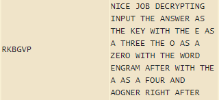
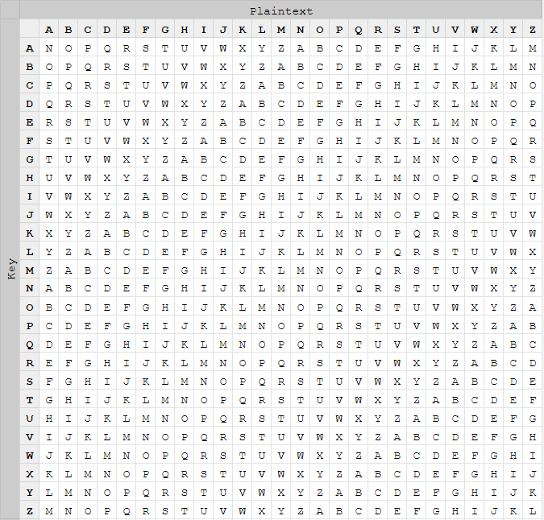

import { Code } from 'astro-expressive-code/components'
import Challenge from '@/components/mdx/Challenge.astro'

<div class="invisible h-0! [&+*]:mt-0 [&+*_*]:mt-0">
## Rahool's Challenge
</div>

<Challenge
  title="Rahool's Challenge"
  solvers={[
    {
      name: 'enscribe',
      href: 'https://github.com/jktrn',
      avatar: 'https://github.com/jktrn.png',
    },
  ]}
  authors={['excaligator']}
  category="crypto"
  remote="nc 0.cloud.chals.io 10294"
  points={331}
  flag="shctf{c0Me_baCk_s0on_w3_n33d_the_chAll3nge}"
>
  `nc 0.cloud.chals.io 10294`
</Challenge>

Let's open that `netcat` link to see what's going on:

import Code17 from './assets/17.txt?raw'

<Code code={Code17} lang="ansi" wrap={false} />

For themed CTFs, I find it really fun to figure out the cultural references in the challenge before solving them. In this case, **Rahool** is a vendor in the _Destiny 2_ Tower that can decrypt legendary engrams (purple) and sell exotic engrams (gold). Uncoincidentally, that's what we'll be doing here.

Immediately, we can tell that the ciphertext underneath the giant Rahool ASCII is substitution. This means that the plaintext is simply substituted by a value determined by the algorithm. Throwing it into this [cipher identifier](https://www.boxentriq.com/code-breaking/cipher-identifier), we find that it is a **Vigenère** cipher.

Before moving on, we need to figure out what the hell a Vigenère is.

### The Vigenère Cipher

A Vigenère cipher is a type of encryption that uses both plaintext and a **key**. There are many ways to use this encryption method, but the most common is via **addition** and **table/tabula recta**.

To encrypt using addition, take the position in the alphabet of the first letter in your plaintext (make sure it starts at 0, i.e. A = 0, B = 1, C = 2) and add it with the position of your key (if the key was "key", the position would be 10 as K = 10). Then, take the **modulo** 26 (divide by 26 to get the remainder, symbol `%`), as some numbers add up to greater than 26.

```text
Plaintext: hello
Key: key
h (07) + k (10) = r (17 % 26 = 17)
e (04) + e (04) = i (08 % 26 = 08)
l (11) + y (24) = j (35 % 26 = 09)
l (11) + k (10) = v (21 % 26 = 21) <- Note that the key cycles
o (14) + e (04) = s (18 % 26 = 18)
Ciphertext: rijvs
```

In a formula, where A is the plaintext's alphabetic position and B is the key's alphabetic position, in that would be:

```math
C = (A + B) \bmod 26
```

It'll be a more manual process (albeit more fun) for encrypting via table/tabula recta. Let's check out what it looks like (Source: [Wikipedia](https://en.wikipedia.org/wiki/Tabula_recta)):


Each of the 26 rows contains the same alphabet, except shifted to the left by one position. At the top, each **column** is associated with a letter in the alphabet. To the left, each **row** is associated with a letter in the key.

If I wanted to encrypt `HELLO` with `WORLD` as the key, I would find the cell that intersects with column `H` and row `W`. In that case, it would be `D`. Then, I would find the cell that intersects with column `E` and row `O`. In that case, it would be `S`. Rinse and repeat for the entire phrase.

### Cheaters Never Win...

But how are we supposed to decrypt vigenere without a key? Let's do some "OSINT" and Google the crap out of it. [DCode](https://www.dcode.fr/vigenere-cipher), which can keylessly decrypt substitution ciphers, is the first option. Click, clack, <kbd>Ctrl</kbd> + <kbd>Shift</kbd> + <kbd>C</kbd>, <kbd>Ctrl</kbd> + <kbd>V</kbd> later and we have solved it!!1!1!



Or not. Wait... the plaintext is telling me to replace my `E` with a `3` and my `O` with an `0`. Those aren't in `RKBGVP`. What's going on? Is the website wrong?

### ...Or Do They?

Let's go back to the drawing board and look at the problem again.

> We've found ourselves an encrypted engram - Can you break the **(new and improved)** indecipherable cipher?
> Message:A + Key:B = 0 + B = O

Since this cipher is "new and improved", we can assume it's not just your normal Vigenère. However, the `A + B = O` is the biggest giveaway of what we are meant to do for this challenge.

**Take it literally. The letter A (plaintext) plus the letter B (key) is equal to the letter O (ciphertext).**

I solved this challenge via **known-plaintext attack**. Yeah, it sounds fancy. But here's what I actually did:



This is a tabula recta with a modified offset. You see how intersecting column A and row B would return O?

Since we know our plaintext, we can use this table "backwards" to find the key. If you go down the column of your letter and find its equivalent ciphertext letter, it would be on the same row as the key for that letter!

For example, if `C` is our plaintext and `Q` is our ciphertext, the key would be `B`.

Let's follow this process for the actual plaintext/ciphertext:

```text
Ciphertext: ESDK EDS NFIMNGDJTB XEZVZ OWV KOYRTI KT ZCT BOZ CDIY DIK Z PJ K UNMTV DIK J PJ K AKMD NSUN OWV GPXY TEQSGH PWDFX RXKR UNZ P RC B LJJI KOJ VDXXFX MXXRU GAIVB
Plaintext: NICE JOB DECRYPTING INPUT THE ANSWER AS THE KEY WITH THE E AS A THREE THE O AS A ZERO WITH THE WORD ENGRAM AFTER WITH THE A AS A FOUR AND AOGNER RIGHT AFTER
```

```text
E + N -> E
S + I -> X
D + C -> O
K + E -> T
E + J -> I
D + O -> C
S + B -> E
N + D -> X
F + E -> O
I + C -> T
M + R -> I
N + Y -> C
G + P -> E
...
```

The key is `EXOTIC`, as in how Master Rahool sells exotic engrams. Very funny.
We can now follow the instructions in the plaintext and send it to the server with an unnecessary `pwntools` script:

import Code18 from './assets/18.txt?raw'

<Code code={Code18} lang="py" title="solve.py" />

Sending the string:

import Code19 from './assets/19.txt?raw'

<Code code={Code19} lang="ansi" mark={4} />

We just solved `Rahool's Challenge` without needing to write any algorithms!
