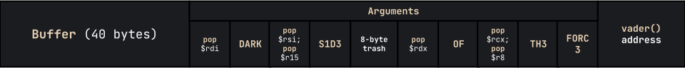
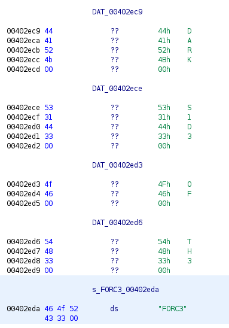

import { Code } from 'astro-expressive-code/components'
import Challenge from '@/components/mdx/Challenge.astro'
import Callout from '@/components/mdx/Callout.astro'

## Vader

<Challenge
  title="Vader"
  solvers={[
    {
      name: 'enscribe',
      href: 'https://github.com/jktrn',
      avatar: 'https://github.com/jktrn.png',
    },
  ]}
  authors={['v10l3nt']}
  category="pwn"
  points={100}
  files={['vader']}
  remote="nc 0.cloud.chals.io 20712"
  flag="shctf{th3r3-is-n0-try}"
>
  Submit flag from `/flag.txt` from `0.cloud.chals.io:20712`
</Challenge>

import Code6 from './assets/6.txt?raw'

<Code code={Code6} lang="ansi" />

### Static Analysis

As with any other sourceless pwn challenge, we first need to boot it up in the **Ghidra** disassembler for static analysis. Let's check what our `main(){:c}` function does:

import Code7 from './assets/7.txt?raw'

<Code code={Code7} lang="c" title="main()" />

Looks like it reads our input (`stdin`) with a fixed length of 256 through `fgets(){:c}`. Let's continue sifting around:

import Code8 from './assets/8.txt?raw'

<Code code={Code8} lang="c" title="vader()" />

The goal is now clear: call the `vader(){:c}` function with five correct arguments to print the flag. Simple, right? Let's start building our chain.

Firstly, we need to calculate our **offset**. Although we can brute this by simply passing a `cyclic` string and seeing what's overwritten the `$rsp` register, we can see that in the `main(){:c}` function, 32 bytes are allocated to `char local_28{:c}`. We can assume this is the buffer, so if we overflow this and append an additional 8 bytes to cover the `$rbp` register, our offset is 40.

Next in line is the process of getting our arguments on the stack. Arguments to be passed into functions are also held in registers -- we need to figure out which ones we need to use to pass the correct arguments (`DARK`, `S1D3`, `OF`, `TH3`, `FORC3`) into `vader(){:c}`. Referencing [this x64 cheatsheet](https://cs.brown.edu/courses/cs033/docs/guides/x64_cheatsheet.pdf) (as the registers are different depending on the bitness/architecture of the ELF):

> To call a function, the program should place the first six integer or pointer parameters in the registers `$rdi`, `$rsi`, `$rdx`, `$rcx`, `$r8`, and `$r9`; subsequent parameters (or parameters larger than 64 bits) should be pushed onto the stack, with the first argument topmost. The program should then execute the call instruction, which will push the return address onto the stack and jump to the start of the specified function.

Therefore, we need to put our arguments into `$rdi`, `$rsi`, `$rdx`, `$rcx`, and `$r8`.

### Gadget-Finding

The main method of adding our arguments is via **gadgets**, or simple assembly instructions that can be used to `pop` specific registers from the stack. After the `pop`, we can repopulate the register with our own address that represents the required string (this address will be located within the binary). Additionally, they almost always have a `ret` instruction at the end to return to _even more_ gadgets, therefore creating a **ROP chain**.

<Callout variant="remark">
The program literally provides gadget functions for you:

import Code9 from './assets/9.txt?raw'

<Code code={Code9} lang="ansi" />

Although you can use these, it's not really in the nature of a ROP challenge, so I will be finding the gadgets manually!
</Callout>

To find the gadgets we need, we will be utilizing a program called `ropper` and `grep`-ing the output:

import Code10 from './assets/10.txt?raw'

<Code code={Code10} lang="ansi" mark={15} />

Check it out -- at the bottom of the code block (`0x40165b`) there's a perfect gadget for us to use! Let's find ones for the rest of them:

import Code11 from './assets/11.txt?raw'

<Code code={Code11} lang="ansi" />

The first `pop rsi; pop r15;{:ansi}` isn't ideal, as it's popping a redundant register -- we'll need to repopulate it with 8 bytes of garbage. On the other hand, the `pop rcx; pop r8;{:ansi}` takes care of two registers at once!

With that, we can draw up a visual of what our final payload will look like:

The last thing we need to do is to find the hex addresses of our argument strings:

Don't forget the address of `vader(){:c}` too!:

import Code12 from './assets/12.txt?raw'

<Code code={Code12} lang="ansi" />

### Putting It All Together

Here is my final script, which defines a variable for each section of our gigantic payload — this is for enhanced readability. I've also used the `p64(){:py}` function, which converts the address into little endian:

import Code13 from './assets/13.txt?raw'

<Code code={Code13} lang="py" title="solve.py" />

I don't usually do this, but here's a clip of me initially solving the challenge by running the above script:

<iframe
    width="560"
    height="315"
    src="https://www.youtube.com/embed/rvMORfSC2CU"
    frameborder="0"
    allow="accelerometer; autoplay; encrypted-media; gyroscope; picture-in-picture"
    allowfullscreen
    className="my-6 mx-auto"
/>

This is considered a "simple" challenge for those experienced with the field of return-oriented programming within pwn/binary challenges. However, I had none prior to this competition, so Vader was one of the most time-consuming and annoying challenges to work with. Yet, it was probably the most satisfying solve throughout the entire competition, and it was my first time utilizing gadgets and building a ROP chain. I hope you enjoyed!