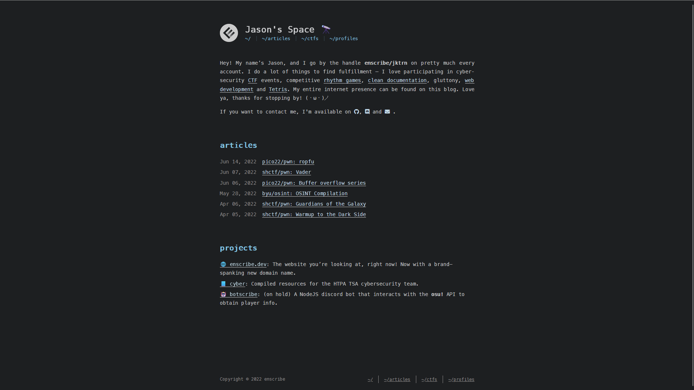
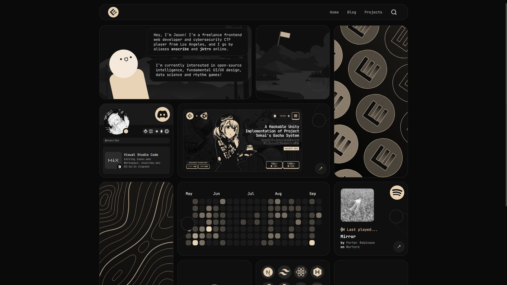
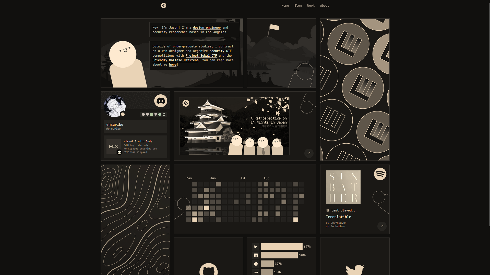
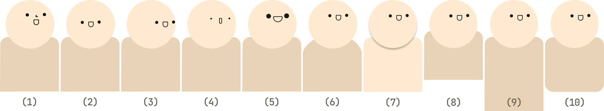
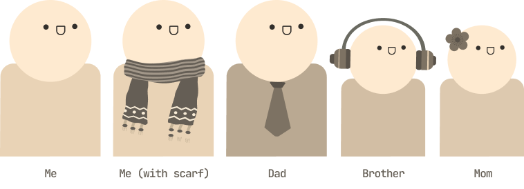
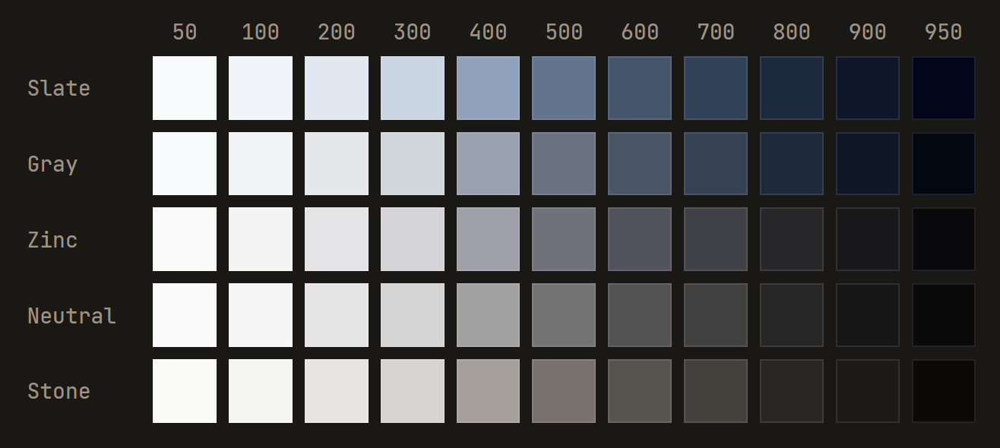

import Callout from '@/components/mdx/Callout.astro'
import StaticTweet from '@/components/mdx/StaticTweet.astro'

## Introduction

I believe that field of frontend web development has, for better or worse, become a solved problem. No-code, prompt-driven tooling like [v0.dev](https://v0.dev) and [Lovable](https://lovable.dev/) have trivialized website creation -- you ask for anything with natural language, it spits something out, and you're prompted to seamlessly deploy it to some hosting solution like Vercel or Netlify. In no step throughout this process did an end user need to code or configure. Frontend has become even more accessible for those already technically proficient in other fields <span class="text-muted-foreground">(e.g. backend/infra people)</span> since they can just "vibe" a frontend and focus on "the more important things."

We celebrate this as some form of democratization -- it's great that someone non-technical doesn't need to go through the hurdles of wrangling with HTML and stylesheets. Yet, as I've observed this rapid industrialization of web creation, I've also noticed the quiet death of something that I hold incredibly dear -- **intentionality**.

The web is by far and away my favorite place to design. I embrace all of its ridiculous constraints, compatibility issues, its nonsensical caveats. I find that the "functional" or "conversion-oriented" perspective that the SF tech-bro archetype often opt for is completely moronic, and the web, at its best, is a medium for human expression. We take all of these disparate components -- typography, color theory, micro-interactions, negative space -- and turn them into an experience that can reveal something essential and meaningful about the creator. **This, by definition, is what art is**. The titration of this process into a prompt window is tragic and horrifying.

### Who to blame

I think the problem always ends up coming back to tech bros. To help understand this, I'll establish two "worlds" that one can affiliate themselves with: the tech world, and the art world.

#### The art world vs. AI

When Stable Diffusion dropped for AI-generated imagery <span class="text-muted-foreground">(I tread carefully here to not call it "AI art" because that is an oxymoron)</span>, artists didn't just complain about job displacement or "loss of opportunity" <span class="text-muted-foreground">(an economic reason)</span>, but they also articulated why the process of creation matters <span class="text-muted-foreground">(an ideological reason)</span>. The resistance in the art world, at least to me, has worked to some capacity -- AI imagery is still widely considered to look hollow. soulless, and/or uncanny by broader culture. I think there's two reasons why this is the case:
1. The art world has had actual *millennia* to establish the cultural infrastructure they need to resist AI takeover. Anyone with a pulse understands the value that art provides to human expression, and how taking away the human touch leaves effectively nothing.
2. The more "expressive" a medium is <span class="text-muted-foreground">(e.g. poetry, painting, music, etc.)</span>, the more difficult it is to justify being replaced by AI. Design leans more towards the "functional" side of the spectrum, since design is partially intended to help drive conversion and engagement.

#### The tech world vs. AI

The tech world's response to LLMs has been effectively self-sabotage. I have way too much to complain about regarding this matter, so I'll divvy it up:

- **Developers revel at their own obsolescence.** They'll call themselves 100× engineers with their multi-instances of Devin or Claude Code or whatever solution will replace the highest percentage of brain matter.
- **Everyone is an ["entryist piece of shit."](https://geohot.github.io/blog/jekyll/update/2025/09/13/get-out-of-technology.html)** Remember how I mentioned that artists gave both economic and ideological reasoning behind resisting AI? Tech bros frankly only care about the money part, that's why they're in the business -- as such, as long as you exist in the tech sphere you will perpetually hear *"wahh I'm gonna be unemployed"* and *"wahh I'm being replaced by a chatbot"* and *"when are they implementing <abbr title="Universal Basic Income">UBI</abbr>?"* rather than anything ideological.
- **Tech culture fetishizes efficiency.** We want the "smartest" solutions to have the least friction and effort. That's why you see so many Twitter blue-checkmark tech microcelebrities <span class="text-muted-foreground">(who, by the way, all have rocks in their heads)</span> with Ghibli-style AI-generated profile pictures because in their head, they've outclevered the system by obtaining a "good enough" heuristic of what their face looks like without needing the assistance of an artist or, God forbid, learning how to draw themselves or, God forbid, just using a normal profile picture off Google Images like everyone else has been for the past 50 years. The inherent generic-ness of a shitty Ghibli profile picture doesn't ever register as a problem for them because they're optimizing different variables entirely.
- **Creative deprivation is cancerous.** People immersed in tech environments have emasculated themselves of creative expression due to a culture that exclusively rewards analytical thinking while systematically assigning creativity as something "frivolous" or "too abstract" or somehow less serious than "real work."

#### The design world vs. themselves

The design industry, specifically scoped to web design, is even worse off. Since it sits in the uncomfortable grey-area between the tech world and the art world, neither party claims it. Yet, it still remains vulnerable to the relentless optimization of the former and the relentless subjectivity of the latter.

Even before AI tooling, we've been self-sabotaging our creative liberties through aggressive standardization and abstractions in the name of "best practices" <span class="text-muted-foreground">(I'll admit that many of these best practices are valid and good, but the caveat comes soon)</span>. We homogenize visual language with component libraries and design systems, which eliminate the need to make aesthetic decisions because these libraries are marketed as "designed by professionals" and "best practice." Even though it seems logical/optimal that we use these <span class="text-muted-foreground">(lest we reinvent the wheel through remaking 40 different button states and form fields for every client)</span>, now everything on the internet that is "best practice" also happens to look exactly like each other. A landscape painting with templated trees that are "very tree-like" and "psychologically optimized to look like a tree" and a pre-made mountain loses a bit of soul, don't you think?

The greatest offender is, in my opinion, [shadcn/ui](https://ui.shadcn.com) <span class="text-muted-foreground">(with Google's Material design system coming in close)</span>:

<div class="grid grid-cols-1 sm:grid-cols-2 gap-2 my-6 [&_*]:m-0">
  <div>
    
    <figcaption className="[&>p]:text-muted-foreground text-center [&>p]:mt-2 [&>p]:mb-4">
      shadcn/ui design system
    </figcaption>
  </div>
  <div>
    
    <figcaption className="[&>p]:text-muted-foreground text-center [&>p]:mt-2 [&>p]:mb-4">
      Google's Material design system
    </figcaption>
  </div>
</div>

shadcn/ui is actually nice to use, since it follows great accessibility standards and UX expectations <span class="text-muted-foreground">(for example, tabbing to a button should show a border ring to indicate it is in-focus)</span>. Its primary issue, which funnily enough is completely out of its control, was that it attempted to mitigate the everything-looks-the-same issue by claiming itself to be a clean baseline that its users can customize and build on top of <span class="text-muted-foreground">(hell, the first sentence in the documentation is **"This is not a component library. It is how you build your component library."**)</span>. To no one's surprise, everyone decided to rawdog the standard library without any customization, defeating its entire purpose and making the web look even more same-y but now with a different and cool Vercel hacker Next.js aesthetic.

This has only been exacerbated with LLMs -- of course it would like these standardizations, because then its less context that it has to eat to generate a button or an input. Anthropic models tend to shit out React and default shadcn/ui components without you even asking for it <span class="text-muted-foreground">(imagine saying "How should I structure my essay?" and it outputs a React-based flowchart)</span>. Even though we used to manually place the templated trees and mountains in their various locations on the canvas, which was better than nothing, now we have fucking robots that will do it for you in a hyperoptimized and speedy way that makes your landscape painting look maximally landscape-y. And everyone in industry took the bait.

### Beyond the purple gradient

I think it's fine to embrace these tools as "a means to an end" for things that you can't be bothered with. You cannot catch me lacking because it is evident from my [WakaTime](https://wakatime.com/@jktrn) that I have 1,000 hours in Cursor. My point is that we cannot be replacing the only good thing that's left within frontend web development, the design aspect, with slop. In a similar manner to how we quickly figured out what constitutes AI prose <span class="text-muted-foreground">(e.g. overusing "It's not just [A], it's also [B]" form, vocabulary such as "tapestry" and "embodiment," em dashes, colons in titles, etc.)</span>, our pattern recognition skills have quickly enabled us to point out a vibed website. See this tweet chain:

<StaticTweet
  avatar="https://pbs.twimg.com/profile_images/1303727365265203200/0cgHOP3y_400x400.jpg"
  username="Rhys"
  handle="RhysSullivan"
  date="9:15 AM · Sep 12, 2025"
  src="https://twitter.com/RhysSullivan/status/1700161234567890123"
  media="https://pbs.twimg.com/media/G0qKOxea4AEPFQ2?format=jpg&name=small"
>
  how it feels opening a website and seeing that purple gradient
</StaticTweet>

<StaticTweet
  avatar="https://pbs.twimg.com/profile_images/1949145162401136640/yxFdO84t_400x400.jpg"
  username="Jovan"
  handle="jovan___jovan"
  date="12:40 PM · Sep 12, 2025"
  src="https://twitter.com/jovan___jovan/status/1700176543210987654"
>
  &gt; Corner Radius<br />
  &gt; Inter Font<br />
  &gt; That Spacing
</StaticTweet>

It's actually funny that these people are entirely right about the design patterns that leading models have latched onto. I gave the generic prompt "Make a generic tech waitlist" to both v0 and Claude, which both spit out exactly what the tweets describe:

<div class="grid grid-cols-1 gap-2 my-6 [&_*]:m-0">
  <div>
    
    <figcaption className="[&>p]:text-muted-foreground text-center [&>p]:mt-2 [&>p]:mb-4">
      v0-generated waitlist
    </figcaption>
  </div>
  <div>
    
    <figcaption className="[&>p]:text-muted-foreground text-center [&>p]:mt-2 [&>p]:mb-4">
      Claude-generated waitlist
    </figcaption>
  </div>
</div>

I just want to emphasize that there are entire universes of creative opportunities that arise from designing and implementing your sites with **(1) soul** and **(2) intention**. The concept of "making the web more fun" is overused, but I genuinely believe that when you have fun designing, your visitors will have fun looking at what you create. Care about inconsequential things that people will never see, consider things that might never happen, pay the greatest attention to detail as you can possibly muster. This is my design philosophy, and I hope this is reflected in the work that I produce. I love what I do, and the process doesn't feel like work to me. Maybe this will be the case for you as well.

### Developing subconscious taste

At this point, I'd like to transition into my actual design process. The word "process" here sucks because there's an implication of coherentness and order but, of course, this is never the case. There are a couple immediate issues I see:

1. **Design requires "taste."** Taste is such a horrible thing because many people dismiss it as something that is just magically handed to you by the grace of God as an infant. Taste is, when condensed, the ability to subconsciously understand when something looks/feels/smells/tastes/sounds "correct" <span class="text-muted-foreground">(input)</span>, or the abililty to create that something <span class="text-muted-foreground">(output)</span>. Condensed even further, it is dozens, if not hundreds of micro-decisions that you either consciously or unconsciously make when intaking or outputting something. Although taste can be a talent, it is also a skill, and it needs to be honed through experience and practice <span class="text-muted-foreground">(similar to anything that a human can be "good at," e.g. you are somehow a piano prodigy but you are nothing without practice)</span>.
2. **You'll be perpetually unhappy with what you make.** This is due to either **(1)** you haven't iterated enough, or **(2)** you've iterated a lot but you're approaching it from the wrong angle. This is probably the biggest barrier that I face, and for this reason I often employ a "pair designing" strategy which basically guarantees a fresh perspective on anything you create.
3. **It's difficult to quantify improvement.** Continuing that piano analogy I made earlier, it's easier to see improvement via harder repetoire or more emotional/nuanced performances. In design, something simply "looking better" is hard to quantify, but it is often the case that when looking back at previous work, you have a sense of linear progression in terms of how happy you are with the result in retrospect. The further you go back in your portfolio, the more flaws you should be able to point out and the more <i>"I would have done this differently"</i>s you should be able to say.

My goal by the end of this post is to have someone who otherwise dismisses themselves as "horrible at design" <span class="text-muted-foreground">(the majority of technical people)</span> understand that design isn't daunting, but rather a productive <span class="text-muted-foreground">(in that it's still tech-related)</span> way to express yourself. Maybe it will incentivize you to vibe less of your frontend and make something fun.

---

## Actually personal websites

The rest of this post will be dedicated to explaining something that I've poured my heart into these past four years: this website! It's a great example of how I approach design because it's probably the most soulful thing that I've made. It's hard to get more personal than a personal website, and it really sucks when people make generic white-on-black or black-on-white sites for the sake of "looking clean." Us humans are messy and filled with dreams, aspirations, nostalgia, cherished things, cherished people, so it's never a bad idea to really show who you are.

I will go through the entire process, from start to finish, denoting as many subconscious decisions as I possibly can, of how I designed and implemented the homepage of my website. If I were to give you homework, it would be to run through this process yourself on your own website <span class="text-muted-foreground">(or start making one if you don't have one yet).</span>

### Iteration, ideation

Of course, I didn't start with a bento box. The current homepage has had multiple dozens of revisions done to it since I came up with the idea in 2023. I, and most likely you, started with a generic hackery template theme as well -- it was only after countless ideas accumulating on top of each other that it got to this point. Here are some screenshots of progression of my website, which coincidentally has had one major design overhaul every year for the past four years:

<div class="grid grid-cols-1 sm:grid-cols-2 gap-2 my-6 [&_*]:m-0">
  <div>
    
    <figcaption className="[&>p]:text-muted-foreground text-center [&>p]:mt-2 [&>p]:mb-4">
      2022
    </figcaption>
  </div>
  <div>
    
    <figcaption className="[&>p]:text-muted-foreground text-center [&>p]:mt-2 [&>p]:mb-4">
      2023
    </figcaption>
  </div>
  <div>
    
    <figcaption className="[&>p]:text-muted-foreground text-center [&>p]:mt-2 [&>p]:mb-4">
      2024
    </figcaption>
  </div>
  <div>
    
    <figcaption className="[&>p]:text-muted-foreground text-center [&>p]:mt-2 [&>p]:mb-4">
      2025
    </figcaption>
  </div>
</div>


Although they may look very different, particularly because my design skills improved throughout this entire process, in general I followed several mantras through every iteration:

- **My homepage should quickly introduce myself.** I used to do this with a small paragraph blurb, but when I was making the bento box, I really felt like it looked like a cartoon panel. As such, I opted for the approach of having text bubbles come out of the bean guy to emulate me "talking" to the user, which makes it feel a tad bit more personal.
- **My homepage should have interactivity.** Little micro-interactions, no matter how small, can provide a lot of life to an otherwise static site. This is why I ended up adding those hover effects. You'll see the implementation process for these later.
- **My homepage should show data about myself.** This ended up being the Spotify status, Discord status, WakaTime bar chart, and the GitHub calendar. In hindsight, this idea was incredible, since there are lots of disparate but related things, which is perfect for a bento box format.
- **My homepage should be engaging.** If we regress back to the SF tech-bro mentality, the goal of a homepage is to get the user to interact and move somewhere else that retains them on the site <span class="text-muted-foreground">(a.k.a. exploring).</span> All of the above help increase retention <span class="text-muted-foreground">(you need to stay a bit longer to comprehend and explore the graphs, micro-interactions, hover effects, etc.)</span>. I also include social links that will further coax the user into doing something insidious, like following me on [Twitter](https://twitter.com/enscry) and [GitHub](https://github.com/jktrn) <span class="text-muted-foreground">(do that please, you're already here!)</span>.
- **My homepage should show character.** Although I used to do this with the way I write, eventually this ended up manifesting as an actual character <span class="text-muted-foreground">(the sepia-colored cartoon guy you see throughout my blog, which we'll call a "bean guy").</span> The bean guy is a caricature of myself that I started doodling in middle school, mostly because I couldn't draw people well <span class="text-muted-foreground">(and also because he just looks cute).</span> Even if no one else knows the backstory, adding something so personal gives the site a unique touch and makes it feel more alive.
    <Callout variant="intuition" title="Making the bean guy">
    To illustrate what I mean by "denoting as many subconscious decisions as I possibly can," let me go through the process of how I made the bean guy:

    <span class="[&>img]:border-none"></span>

    The choices behind this design weren't made through conscious deliberation <span class="text-muted-foreground">(or if they did, they happened in seconds)</span>, meaning they just felt right to me; I didn't need to experiment or iterate much to get to a point where I was happy:

    <span class="[&>img]:border-none"></span>
    
    <div class="grid grid-cols-1 sm:grid-cols-2 gap-4">
      <ol class="list-decimal list-inside space-y-2 ml-0 [&>li::marker]:[content:'('counter(list-item)')_']">
        <li>Adding a nose is fine, but for some reason leaving it out makes the character cuter, so no nose.</li>
        <li>Placing the face exactly in the center makes him look too chubby for my taste.</li>
        <li>Putting the face too close to the edge looks odd, so I keep it off-center with enough padding inside the head.</li>
        <li>If the eyes are too small or the mouth too narrow, he looks derpy.</li>
        <li>If the eyes or mouth are too large, he starts to look like a monster.</li>
      </ol>
      <ol class="list-decimal list-inside space-y-2 ml-0 [&>li::marker]:[content:'('counter(list-item)')_']" start="6">
        <li>The shoulders can't be too wide, or he looks slumped.</li>
        <li>The body color should differ from the face to separate them visually. Even though there's a shadow added under the chin here, it doesn't do enough visually.</li>
        <li>The bean needs human proportions; here, the shoulders are too high and the body too short.</li>
        <li>The body shouldn't be too long.</li>
        <li>If you add rounded corners to the bottom, then the shoulders lose their "shoulder" shape.</li>
      </ol>
    </div>

    Another great thing about the bean guy is that because he is so simple, he is also easily accessorized:

    <span class="[&>img]:border-none"></span>

    This was great to use in my [Japan retrospective](/blog/japan-retrospective) post to censor out my family members' faces whilst still identifying them. There are also a lot of details here:
    
    - The accessories actually represent habits that my family members have <span class="text-muted-foreground">(e.g. Dad wearing a tie, Little Brother always wearing headphones, Mom with a flower pin)</span>.
    - In general, everything has to be sepia-colored to match the overall theme. The accessories I picked were either hand-made or found on Google Images with the `filetype:svg` filter.
    - Even though Dad can wear a tie, I also decided that he'd have a darker body color to differentiate him from me <span class="text-muted-foreground">(the unaccessorized bean)</span> since we both have no accessory on our heads. In the end, everyone has a very slightly different body color, which might not be noticeable on bad monitors but is fine for me.
    - The version of me with a scarf is actually only used a single time, on the homepage for when my character is in a "cold climate" setting <span class="text-muted-foreground">(a mountain range)</span>.

    Little details like this can make a big difference in how meaningful your presentation is.
    </Callout>

### Colors

Whenever I make a website, the very first thing I do is think about colors.

#### Connotation, hierarchy

I'm not a color theory snob or anything along those lines, but I do understand that color is incredibly important to conveying a particular connotation to a user, especially when the site is commercial <span class="text-muted-foreground">(e.g. you don't want your yoga class one-pager to be grunge black and blood red)</span>. I don't need to go through all the colors and their cultural connotations since it is self-evident.

We use the 60-30-10 rule to establish hierarchy:

<Callout variant="definition" title="60-30-10 rule">
  The 60-30-10 rule helps us to establish hierarchy. It means that about 60% of your site's visual space <span class="text-muted-foreground">(not actual surface area or pixel count, meaning that a blob of text and a blob of color of the same size both count equally)</span> should use a "primary" color, 30% should use a "secondary" color, and the remaining 10% should be reserved for an "accent" color. Secondary colors are often used to denote sections, while accent colors are used for elements that are meant to grab attention, like buttons or links.
</Callout>

Personally, I find that sticking rigidly to this ratio can feel exhausting, and I prefer to design more intuitively and only refer back to the ratio as a sanity check after the fact.

#### Semantic CSS variables

That said, one guideline I do always stick to is using semantically-named color variables in my CSS, which makes the process so much less painful when you're working with a lot of colors/have to change them. I've provided a large example below to illustrate how this works:

<Callout variant="example" title="Semantic CSS variables">
Let's make a generic hero section! On the left is the HTML source, and on the right is how it renders with no CSS:

<example-section class="grid grid-cols-1 my-4 [&_*]:m-0">
  <example-source>
    ```html title="index.html"
    <section>
      <h1>Welcome to our website</h1>
      <p>This is a really cool website with great colors and fonts!</p>
    </section>
    ```
  </example-source>
  <example-preview>
    <iframe
      srcdoc={`<section>
  <h1>Welcome to our website</h1>
  <p>This is a really cool website with great colors and fonts!</p>
</section>`}
      style={{
        width: "100%",
        height: "100%",
        background: "white",
        colorScheme: "light",
      }}
      sandbox="allow-same-origin"
      className="h-auto w-full"
    />
  </example-preview>
</example-section>

We'll use Tailwind CSS for this example to warm you up with the notation if you've never seen it before, since it will be important later on. The notation is intuitive: `bg-amber-100` adds an amber-colored background of shade `100` to the section <span class="text-muted-foreground">(where Tailwind has shades `100`-`900` in steps of 100, with an additional `950` for super-dark)</span>:

<example-section class="grid grid-cols-1 my-4 [&_*]:m-0">
  <example-source>
    ```html title="index.html"
    <section class="bg-amber-100">
      <!-- 12px bottom margin, 24px font size, 500 font weight -->
      <h1 class="mb-3 text-2xl font-semibold text-stone-900">
        Welcome to our website
      </h1>
      <!-- 1.625 line height, 600 font weight -->
      <p class="leading-relaxed text-stone-500">
        This is a really cool website with great colors and fonts!
      </p>
    </section>
    ```
  </example-source>
  <example-preview>
    <iframe
      srcdoc={`<style>
        section {
          background: #fef3c6;
          padding: 2rem;
        }
        h1 {
          color: #1c1917;
          font-size: 1.5rem;
          font-weight: 600;
          margin-bottom: 0.75rem;
        }
        p {
          color: #79716b;
          line-height: 1.6;
        }
      </style>
      <section>
        <h1>Welcome to our website</h1>
        <p>This is a really cool website with great colors and fonts!</p>
      </section>`}
      style={{
        width: "100%",
        height: "200px",
        background: "white",
        colorScheme: "light",
      }}
      sandbox="allow-same-origin"
      className="h-auto w-full"
    />
  </example-preview>
</example-section>

We can go even further to add a darkmode. With Tailwind, we can add a `dark:` variant prefix to any class to only apply it when the [`prefers-color-scheme` media query](https://developer.mozilla.org/en-US/docs/Web/CSS/@media/prefers-color-scheme) is `dark`. Since we can't demonstrate this without changing system preferences, we'll need to manually control the theme. This is done by overriding the `dark:` variant to select for an attribute `data-theme="dark"`:

```css title="styles.css"
@import "tailwindcss";

@custom-variant dark (&:where([data-theme=dark], [data-theme=dark] *));
```

We can now use this in our HTML with a tiny script that will toggle the `data-theme` attribute. For my colors, I've made the design decision to have a "warm"-temperature light mode <span>(the `stone` palette)</span> and a "cool"-temperature dark mode <span>(the `slate` palette)</span>, since Tailwind's color palettes offer different shades of gray for this use case:



<example-section class="grid grid-cols-1 my-4 [&_*]:m-0">
  <example-source>
    ```html title="index.html" add="data-theme=\"light\"" add="dark:"
    <button onclick="toggleTheme()" class="mb-2">Toggle theme</button>
    <section class="bg-amber-100 dark:bg-slate-800" data-theme="light">
      <h1 class="mb-3 text-2xl font-semibold text-stone-900 dark:text-slate-100">
        Welcome to our website
      </h1>
      <p class="leading-relaxed text-stone-500 dark:text-slate-400">
        This is a really cool website with great colors and fonts!
      </p>
    </section>

    <script>
      function toggleTheme() {
        const section = document.querySelector('[data-theme]');
        const currentTheme = section.getAttribute('data-theme');
        section.setAttribute('data-theme', currentTheme === 'light' ? 'dark' : 'light');
      }
    </script>
    ```
  </example-source>
  <example-preview>
    <iframe
      srcdoc={`
        <style>
          section {
            background-color: #fef3c6;
            padding: 2rem;
          }
          
          section[data-theme="dark"] {
            background-color: #1e293b;
          }

          button {
            margin-bottom: 8px;
          }
          
          h1 {
            color: #1c1917;
            font-size: 1.5rem;
            font-weight: 600;
            margin-bottom: 0.75rem;
          }
          
          section[data-theme="dark"] h1 {
            color: #f1f5f9;
          }
          
          p {
            color: #78716c;
            line-height: 1.6;
          }
          
          section[data-theme="dark"] p {
            color: #94a3b8;
          }
        </style>
        <button onclick="toggleTheme()">Toggle theme</button>
        <section data-theme="light">
          <h1>Welcome to our website</h1>
          <p>This is a really cool website with great colors and fonts!</p>
        </section>
        <script>
          function toggleTheme() {
            const section = document.querySelector('[data-theme]');
            const currentTheme = section.getAttribute('data-theme');
            section.setAttribute('data-theme', currentTheme === 'light' ? 'dark' : 'light');
          }
        </script>
      `}
      style={{
        width: "100%",
        height: "250px",
        background: "white",
        colorScheme: "light",
      }}
      sandbox="allow-same-origin allow-scripts"
      className="h-auto w-full"
    />
  </example-preview>
</example-section>
</Callout>