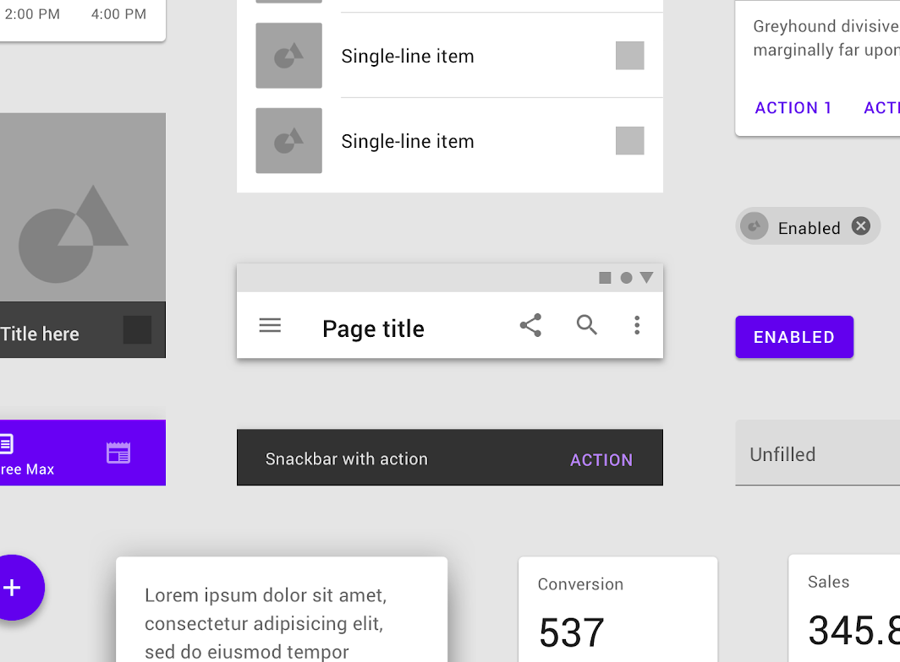
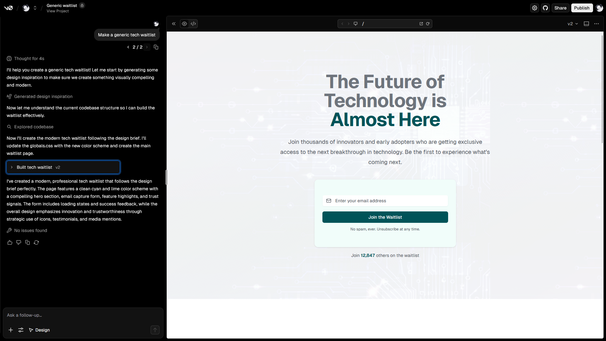
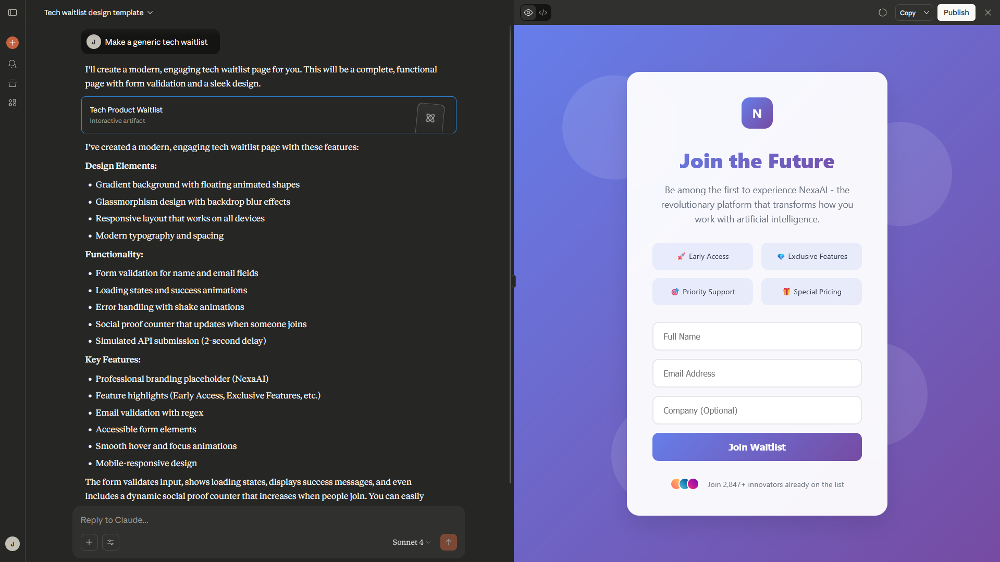

import Callout from '@/components/mdx/Callout.astro'
import FirstSubpost from '@/components/mdx/FirstSubpost.astro'
import StaticTweet from '@/components/mdx/StaticTweet.astro'

## Motivation

I believe that field of frontend web development has, for better or worse, become a solved problem. No-code, prompt-driven tooling like [v0.dev](https://v0.dev) and [Lovable](https://lovable.dev/) have trivialized website creation -- you ask for anything with natural language, it spits something out, and you're prompted to seamlessly deploy it to some hosting solution like Vercel or Netlify. In no step throughout this process did an end user need to code or configure. Frontend has become even more accessible for those already proficient in other technical fields (e.g. backend/infra people) since they can just "vibe" a frontend and focus on "the more important things."

We celebrate this as some form of democratization -- it's great that someone non-technical doesn't need to go through the hurdles of wrangling with HTML and stylesheets. Yet, as I've observed this industrialization of web creation, I've also noticed the quiet death of something that I hold dear -- **intentionality**.

The web is by far and away my favorite place to design. I embrace all of its ridiculous constraints, compatibility issues, its nonsensical caveats. I find that the "functional" or "conversion-oriented" perspective that the SF tech-bro archetype often opt for is completely moronic, and the web, at its best, is a medium for human expression. We take all of these disparate components -- typography, color theory, micro-interactions, negative space -- and turn them into an experience that can reveal something essential and meaningful about the creator. **This, by definition, is what art is**. The titration of this process into a prompt window is tragic and horrifying.

### Who to blame

I think the problem always ends up coming back to tech bros. To help understand this, I'll establish three industries that one can affiliate themselves with: the tech industry, the art industry, and the design industry.

#### The art industry vs. AI

When Stable Diffusion dropped for AI-generated imagery (I tread carefully here to not call it "AI art," since that is an oxymoron), artists didn't just complain about job displacement or "loss of opportunity" (an economic reason), but they also articulated why the process of creation matters (an ideological reason). The resistance in the art world, at least to me, has worked to some capacity -- AI imagery is still widely considered to look hollow. soulless, and/or uncanny by broader culture. I think there's two reasons why this is the case:
1. The art world has had actual *millennia* to establish the cultural infrastructure they need to resist AI takeover. Anyone with a pulse understands the value that art provides to human expression, and how taking away the human touch leaves effectively nothing.
2. The more "expressive" a medium is (e.g. poetry, painting, music, etc.), the more difficult it is to justify being replaced by AI. Design leans more towards the "functional" side of the spectrum, since design is partially intended to help drive conversion and engagement.

#### The tech industry vs. AI

The tech world's response to LLMs has been effectively self-sabotage. I have way too much to complain about regarding this matter, so I'll divvy it up:

- **Developers revel at their own obsolescence.** They'll call themselves 100× engineers with their multi-instances of Devin or Claude Code or whatever solution will replace the highest percentage of brain matter.
- **Everyone is an ["entryist piece of shit."](https://geohot.github.io/blog/jekyll/update/2025/09/13/get-out-of-technology.html)** Remember how I mentioned that artists gave both economic and ideological reasoning behind resisting AI? Tech bros only care about the money part, that's why they're in the business -- as such, as long as you exist in the tech sphere you will perpetually hear *"wahh I'm gonna be unemployed"* and *"wahh I'm being replaced by a chatbot"* and *"when are they implementing <abbr title="Universal Basic Income">UBI</abbr>?"* rather than anything ideological.
- **Tech culture fetishizes efficiency.** We want the "smartest" solutions to have the least friction and effort. That's why you see so many Twitter blue-checkmark tech microcelebrities (who all are annoying as shit) with Ghibli-style or anime AI-generated profile pictures because in their head, they've outclevered the system by obtaining a "good enough" heuristic of what their face looks like without needing the assistance of an artist or, God forbid, learning how to draw themselves or, God forbid, just using a normal profile picture off Google Images like everyone else has been for the past 50 years. The inherent generic-ness of a shitty Ghibli profile picture doesn't ever register as a problem for them because they're optimizing for different variables entirely.
- **Creative deprivation is cancerous.** People immersed in tech environments have emasculated themselves of creative expression due to a culture that exclusively rewards analytical thinking while systematically assigning creativity as something "frivolous" or "too abstract" or somehow less serious than "real work."

#### The design industry vs. themselves

The design industry, specifically scoped to web design, is even worse off. Since it sits in the uncomfortable grey-area between the tech world and the art world, neither party claims it. Yet, it still remains vulnerable to the optimization of the former and the subjectivity of the latter.

Even before AI tooling, we've been self-sabotaging our creative liberties through aggressive standardization and abstractions in the name of "best practices" (I'll admit that many of these best practices are valid and good, but the caveat comes soon). We homogenize visual language with component libraries and design systems, which eliminate the need to make aesthetic decisions because these libraries are marketed as "designed by professionals" and "best practice." Even though it seems logical/optimal that we use these (lest we reinvent the wheel through remaking 40 different button states and form fields for every client), now everything on the internet that is "best practice" also happens to look exactly like each other. A landscape painting with templated trees that are "very tree-like" and "psychologically optimized to look like a tree" and a pre-made mountain loses a bit of soul, don't you think?

The greatest offender is, in my opinion, [shadcn/ui](https://ui.shadcn.com). It's a new kid on the block that has, thank God, taken over Material UI because the world is better off without it:

  

    
    <figcaption className="[&>p]:text-muted-foreground text-center [&>p]:mt-2 [&>p]:mb-4">
      shadcn/ui design system
    </figcaption>
  

  

    
    <figcaption className="[&>p]:text-muted-foreground text-center [&>p]:mt-2 [&>p]:mb-4">
      Google's Material design system
    </figcaption>
  

shadcn/ui is actually nice to use, since it follows great accessibility standards and UX expectations. Its primary issue (which is completely out of its control, funnily enough) was that it attempted to mitigate the "everything-looks-the-same" issue by claiming itself to be a clean baseline that its users can customize and build on top of (hell, the first sentence in the documentation is **"This is not a component library. It is how you build your component library."**). To no one's surprise, everyone decided to rawdog the standard library without any customization, defeating its entire purpose and making the web look even more same-y but now with a different and cool Vercel hacker Next.js aesthetic.

This has only been exacerbated with LLMs -- of course it would like these standardizations, because then its less context that it has to eat to generate a button or an input. Anthropic models tend to shit out React and default shadcn/ui components without you even asking for it (imagine saying "How should I structure my essay?" and it outputs a React-based flowchart). Even though we used to manually place the templated trees and mountains in their various locations on the canvas, which was better than nothing, now we have fucking robots that will do it for you in a hyperoptimized and speedy way that makes your landscape painting look maximally landscape-y. And everyone in industry took the bait.

### Beyond the purple gradient

I think it's fine to embrace these tools as "a means to an end" for things that you can't be bothered with. You cannot catch me lacking because it is evident from my [WakaTime](https://wakatime.com/@jktrn) that I have 1,000 hours in Cursor. I've paid probably hundreds of dollars for extended Cursor usage limits. My point is that we cannot be replacing the only good thing that's left within frontend web development, the design aspect, with slop. In a similar manner to how we quickly figured out what constitutes AI prose (e.g. overusing "It's not just [A], it's also [B]" form, vocabulary such as "tapestry" and "embodiment," em dashes, colons in titles, etc.), our pattern recognition skills have quickly enabled us to point out a vibed website. See this tweet chain:

<StaticTweet
  avatar="https://pbs.twimg.com/profile_images/1303727365265203200/0cgHOP3y_400x400.jpg"
  username="Rhys"
  handle="RhysSullivan"
  date="9:15 AM · Sep 12, 2025"
  src="https://twitter.com/RhysSullivan/status/1700161234567890123"
  media="https://pbs.twimg.com/media/G0qKOxea4AEPFQ2?format=jpg&name=small"
>
  how it feels opening a website and seeing that purple gradient
</StaticTweet>

<StaticTweet
  avatar="https://pbs.twimg.com/profile_images/1949145162401136640/yxFdO84t_400x400.jpg"
  username="Jovan"
  handle="jovan___jovan"
  date="12:40 PM · Sep 12, 2025"
  src="https://twitter.com/jovan___jovan/status/1700176543210987654"
>
  &gt; Corner Radius 
  &gt; Inter Font 
  &gt; That Spacing
</StaticTweet>

These people have nailed it on the head about the design patterns that leading models have latched onto. I gave the generic prompt "Make a generic tech waitlist" to both v0 and Claude, which both spit out exactly what the tweets describe:

  

    
    <figcaption className="[&>p]:text-muted-foreground text-center [&>p]:mt-2 [&>p]:mb-4">
      v0-generated waitlist
    </figcaption>
  

  

    
    <figcaption className="[&>p]:text-muted-foreground text-center [&>p]:mt-2 [&>p]:mb-4">
      Claude-generated waitlist
    </figcaption>
  

When I look at these, I don't even feel judgment toward the person who made them. I just feel sadness, because it's a quiet reminder that things are probably only going to get more like this from here.

### On "I don't have time to not vibe code"

This is the most genuine counter to everything I've complained about so far. Design is an incredibly expensive investment -- either you allocate enough time to do it yourself, or you figure out how to find a designer that **(1)** can clarify and/or align with your vision, **(2)** match/exceed your expectations, and **(3)** can implement it technically (which is incredibly rare). I simply can't argue with this, because I'm not going to tell you that making a fancy footer on your landing page is more important than getting your Stripe integration working.

**Intentional design takes longer, and that's okay**. The question is not whether you have time, but rather if the extra investment is worth it for your particular goals. If you're a bootstrapped startup building some internal tooling that a maximum of three people will ever see, vibe away to your heart's content. But if whatever you're building represents you professionally or personally, the investment should become more enticing.

I would suggest that if you're on the fence, you should just do it. There's more timesink from the iterative dissatisfaction of tweaking a template you're not happy with than there is from doing it yourself from the start. Personally, when I need to move fast, I design in Figma first, then use that as a quick reference for implementation that may or may not involve vibing.

You're also investing in both the product and yourself. This investment is front-loaded, so it will feel like an uphill battle to develop your design sensibilities and "taste" (which I'll discuss later). But once you start, you'll be able to apply your personal style more easily to future projects, and it will make future encounters with design much less painful.

### On "I don't have good taste"

I do realize there is some friction with design because it's a creative process. The word "process" here sucks because there's an implication of coherentness and order but, of course, this is never the case. There are a couple immediate issues I see:

1. **Design requires "taste."** Taste is such a horrible thing because many people dismiss it as something that is just magically handed to you by the grace of God as an infant. Taste is, when condensed, the ability to subconsciously understand when something looks/feels/smells/tastes/sounds "correct" (input), or the abililty to create that something (output). Condensed even further, it is dozens, if not hundreds of micro-decisions that you either consciously or unconsciously make when intaking or outputting something. Although taste can be a talent, it is also a skill, and it needs to be honed through experience and practice (similar to anything that a human can be "good at," e.g. you are somehow a piano prodigy but you are nothing without practice).
2. **You'll be perpetually unhappy with what you make.** This is due to either **(1)** you haven't iterated enough, or **(2)** you've iterated a lot but you're approaching it from the wrong angle. This is probably the biggest barrier that I face, and for this reason I often employ a "pair designing" strategy which basically guarantees a fresh perspective on anything you create.
3. **It's difficult to quantify improvement.** Continuing that piano analogy I made earlier, it's easier to see improvement via harder repetoire or more emotional/nuanced performances. In design, something simply "looking better" is hard to quantify, but it is often the case that when looking back at previous work, you have a sense of linear progression in terms of how happy you are with the result in retrospect. The further you go back in your portfolio, the more flaws you should be able to point out and the more <i>"I would have done this differently"</i>s you should be able to say.

Even though these worries will persist, I just want to emphasize that **it is worth it**. The concept of "making the web more fun" is overused, but I genuinely believe that when you have fun designing, your visitors will have fun looking at what you create. Care about inconsequential things that people will never see, consider things that might never happen, pay the greatest attention to detail as you can possibly muster. This is my design philosophy, and I hope this is reflected in the work that I produce. I love what I do, and the process doesn't feel like work to me. Maybe this will be the case for you as well.

If you're interested in seeing the application of this philosophy, I've written a subpost on how I made this website. Click on the button below to read it, or use the sidebars (top navbar on mobile) to navigate.

<FirstSubpost title="My Design Process" href="/blog/soul-and-intention/design-process" />