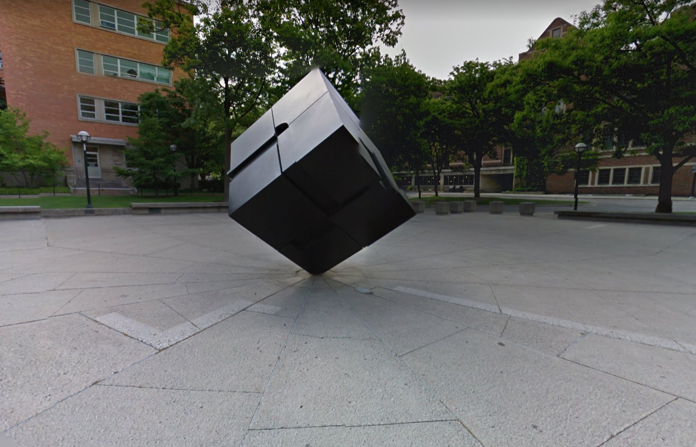
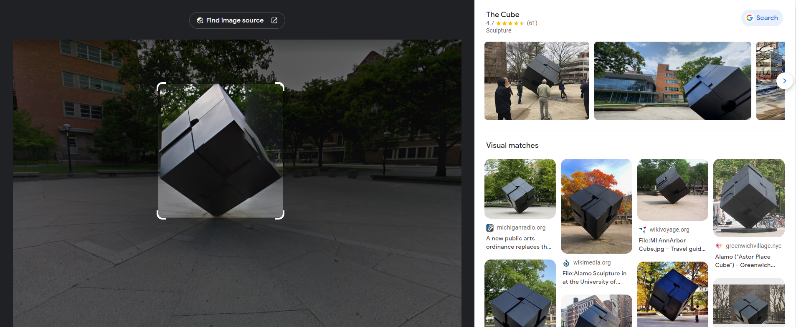
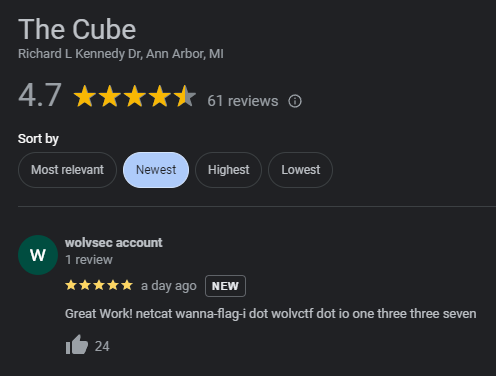

import { Code } from 'astro-expressive-code/components'
import Challenge from '@/components/mdx/Challenge.astro'
import StaticTweet from '@/components/mdx/StaticTweet.astro'

## WannaFlag I: An Introduction

<Challenge
  title="WannaFlag I: An Introduction"
  authors={['dree']}
  solvers={[
    {
      name: 'enscribe',
      href: 'https://github.com/jktrn',
      avatar: 'https://github.com/jktrn.png',
    },
  ]}
  category="OSINT"
  points={188}
  solves={107}
  flag="wctf{uhhh_wh3r3_d1d_4ll_0ur_fl4gs_g0?}"
>
  Welcome to WolvCTF's OSINT Category! We have a bunch of great OSINT lined up, assuming nothing goes wrong hahahhahahhahah but why would it?  
  For this challenge, find where the image was taken, and look at the Google Maps reviews!  
  **Note**: Flags can be found in standard format `wctf{...}` for ALL OSINT challenges   
  <figure>
    

    <figcaption class="text-center text-muted-foreground">image.png</figcaption>
  </figure>
</Challenge>

We're first given a little bit of a warmup: find the location of the following object, and to view its Google Reviews.

Simple task! These types of challenges, often called GEOINT (geospacial intelligence), can be trivial if there is a landmark object situated within the image — in this case, we have some public art resembling a black cube. We can use [Google Lens](https://lens.google) to identify it:

Looks like Google's given us a hit: this is "The Cube," a public art installation in the University of Michigan. Let's take a look at the Google Reviews:

This `netcat wanna-flag-i dot wolvctf dot io one three three seven` can be converted to a command: `nc wanna-flag-i.wolvctf.io 1337`. Let's connect to this server to see what it has to say:

import Code1 from './assets/1.txt?raw'

<Code code={Code1} lang="ansi" />

Well... that was unexpected. Let's first digest what in the world just happened to this netcat:

-   Our flag is cut off midway, and WannaFlag supposedly "pwns" the server
-   We're told to pay 500,000 Goerli to the wallet `0x08f5AF98610aE4B93...`
-   This hashtag `#YourFlagsBelongToUs` is spammed everywhere throughout the message
-   The group tells "John OSINTs" to leave them alone on Twitter

There's a small connection here, but it's not immediately obvious. We can actually search for this hashtag on Twitter, revealing a tweet from none other than `@JohnOSINT_` himself:

<StaticTweet
  avatar="https://pbs.twimg.com/profile_images/1634679088731557889/DkCPnIw__400x400.jpg"
  username="John OSINT"
  handle="JohnOSINT_"
  date="March 11, 2023"
  src="https://twitter.com/JohnOSINT_/status/1634680651768270848"
>
  I've been getting reports of a new ransomware group that have been specifically targeting CTFs. They've been posting [#YourFlagsBelongToUs](https://twitter.com/hashtag/YourFlagsBelongToUs) to their victims and demanding crypto in exchange for the flags and infra back. This is big.....
</StaticTweet>

<StaticTweet
  avatar="https://pbs.twimg.com/profile_images/1634679088731557889/DkCPnIw__400x400.jpg"
  username="John OSINT"
  handle="JohnOSINT_"
  date="March 11, 2023"
  src="https://twitter.com/JohnOSINT_/status/1634682918764429313"
>
  I've only exfiltrated one flag from them so far: d2N0Znt1aGhoX3doM3IzX2QxZF80bGxfMHVyX2ZsNGdzX2cwP30=
</StaticTweet>

A simple [base64 decode](https://www.base64decode.org/) of the exfiltrated string gives us our first flag.