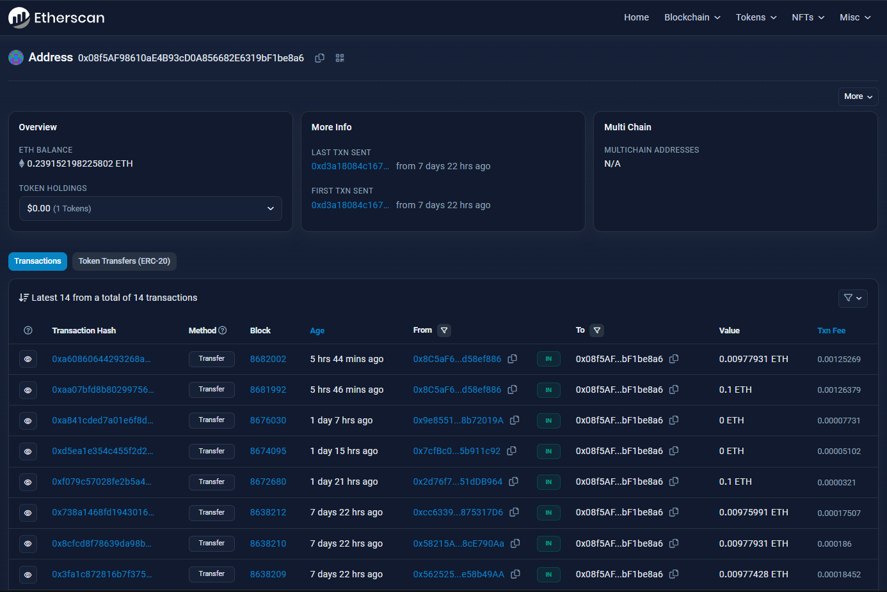
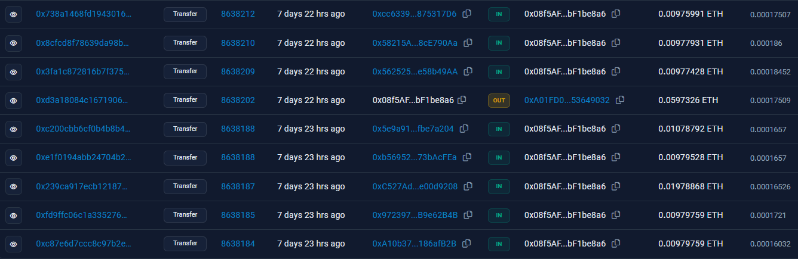
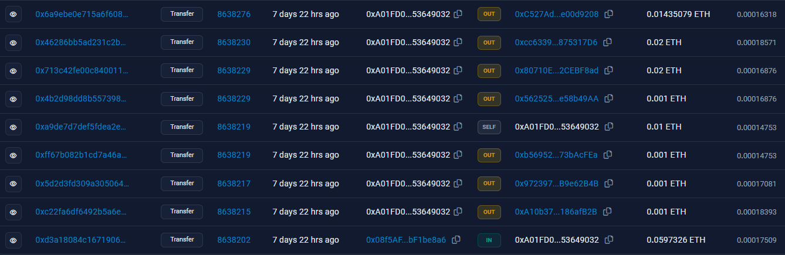
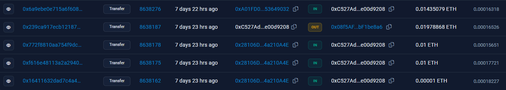
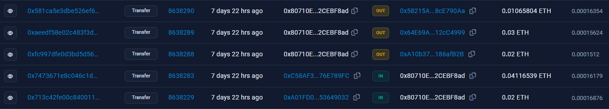
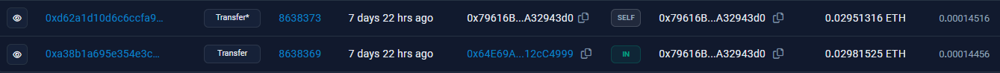
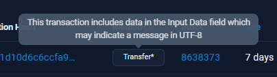
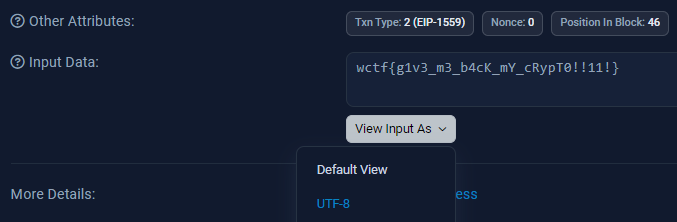
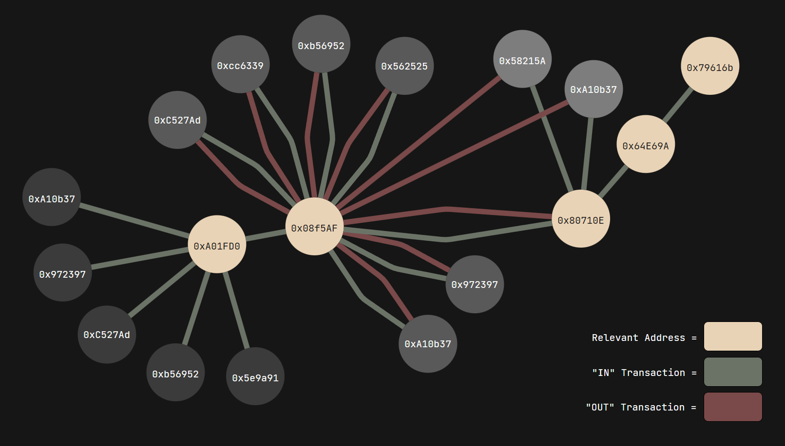

import Challenge from '@/components/mdx/Challenge.astro'

## WannaFlag II: Payments

<Challenge
  title="WannaFlag II: Payments"
  authors={["dree"]}
  category="OSINT"
  points={348}
  solvers={[
    {
      name: 'Legoclones',
      href: 'https://github.com/Legoclones',
      avatar: 'https://github.com/Legoclones.png',
    },
    {
      name: 'sahuang',
      href: 'https://github.com/sahuang',
      avatar: 'https://github.com/sahuang.png',
    },
  ]}
  solves={75}
  flag="wctf{g1v3_m3_b4cK_mY_cRypT0!!11!}"
>
  Ok well.........................something may have gone wrong  
  WannaFlag's ransom demand is insane, there's no way we are paying that. Can you figure out which address the money is being funneled to?  
  From the ransom note: send 500,000 Goerli to `0x08f5AF98610aE4B93cD0A856682E6319bF1be8a6`
</Challenge>

Our next step involves figuring out where this ransom money is being funneled to. We can use [Etherscan](https://etherscan.io/)'s [Goerli Testnet Explorer](https://goerli.etherscan.io/) for transactions involving the address `0x08f5AF98610aE4B93cD0A856682E6319bF1be8a6`:

We can see the transactions this account has made so far, but the only ones that are relevant would be the ones done before the competition started (since those would be part of the challenge creation process). These are the following transactions the account has made within this reasonable scope:

Looks like there's something that stands out — although there are a lot of IN transactions, there's only one OUT transaction. This is the transaction that we're looking for, and it's a pretty big one being sent to `0xA01FD0...`. Let's follow the breadcrumb:

From here, it seems as if the money is being distributed into several different accounts. Upon checking these transactions, though, these addresses actually just loop back the crypto into the original `0x08f5AF...` wallet. Here is an example of one of these "dummy" accounts, `0xc527ad...`; the second transaction on this list sends money back in a seeming "loop":

However, one outlier amongst these OUT transactions exists: the address `0x80710E...`, which funnels these payments into three different accounts:

Once again, two of these accounts are dummies, and will send money back into `0x08f5AF...`. However, one of these accounts, `0x64E69A...`, will send money to a completely new address, `0x79616B...`, where the trail ends:

There's a suspicious SELF transaction on this address. Hovering over it, we can see that Etherscan believes there is a hidden message in the "Input Data" field:

If we take a look at the transaction hash and click on the "More Details" button, we find the flag in the "Input Data" section when decoding it into UTF-8:

If you're lost, I made a visualization of the transactions which took place, highlighting the breadcrumbs which eventually led to the flag:

