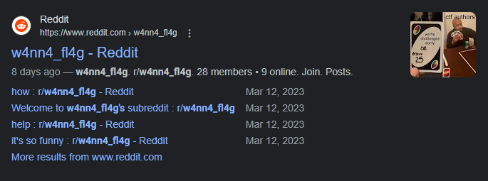
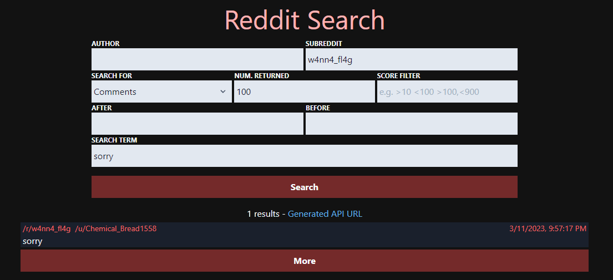
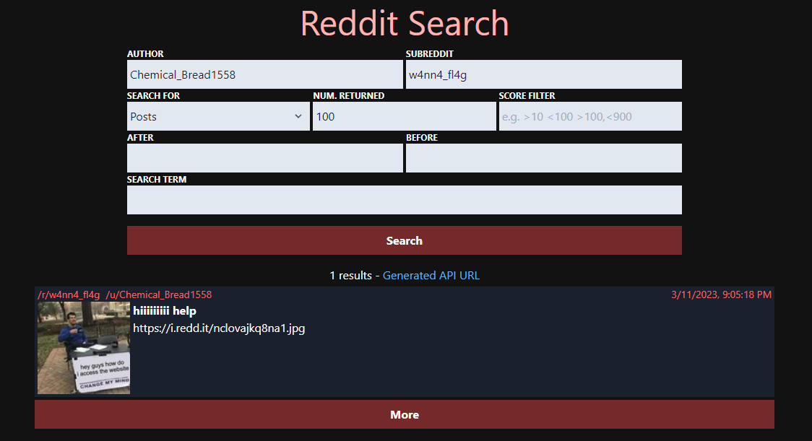
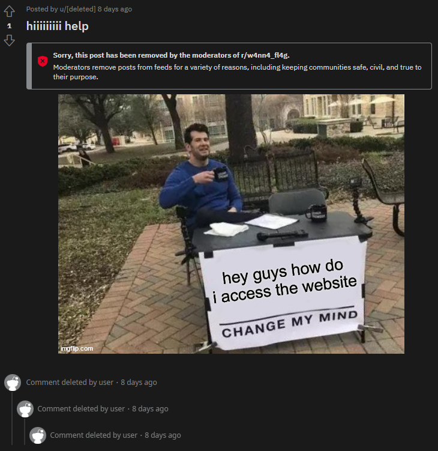
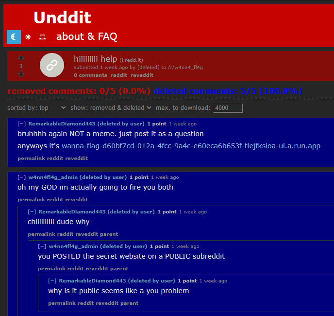
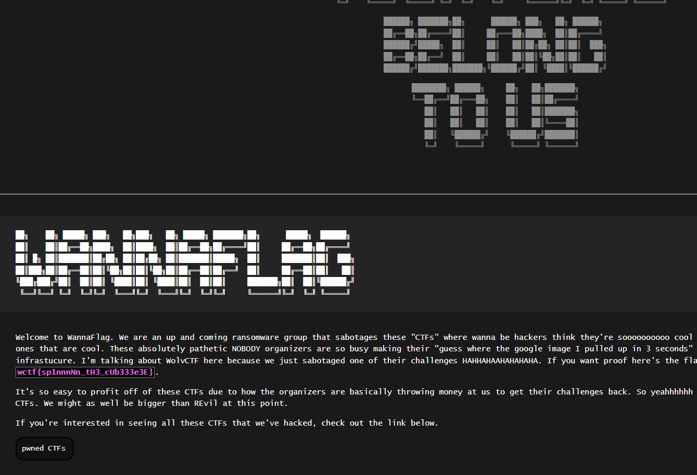

import Challenge from '@/components/mdx/Challenge.astro'

## WannaFlag III: Infiltration

<Challenge
  title="WannaFlag III: Infiltration"
  authors={["dree"]}
  category="OSINT"
  points={318}
  solvers={[
    {
      name: 'enscribe',
      href: 'https://github.com/jktrn',
      avatar: 'https://github.com/jktrn.png',
    },
  ]}
  solves={82}
  flag="wctf{sp1nnnNn_tH3_cUb333e3E}"
>
  We have some solid leads so far. However, we need our flags back. Find a way to locate their communication and infiltrate their private ransom service, and submit the stolen flag we wanted to use for the first OSINT!  
  From outside intelligence, we know the group sometimes goes by `w4nn4_fl4g`
</Challenge>

We're now given a keyphrase to work with: `w4nn4_fl4g`. We can search for the specific term on Google by wrapping it in quotes, and our first result is a subreddit, [r/w4nn4_fl4g](https://www.reddit.com/r/w4nn4_fl4g/):

Looking through the small amount of posts on this locked subreddit, we can find three users in particular which have access to post permissions (alongside one moderator): `u/w4nn4fl4g_admin`, `u/RemarkableDiamond443`, and `u/[deleted]`. None of the posts and memes were particularly interesting or relevant, but one thing stuck out in particular: the deleted user. We can find the username of the user through querying [camas.unddit.com](https://camas.unddit.com/) for a specific comment in `r/w4nn4_fl4g`; let's utilize the comment "sorry" they left under [this post](https://www.reddit.com/r/w4nn4_fl4g/comments/11p6utf/questions/):

We found the original username of the deleted user: `u/Chemical_Bread1558`! We can now query for posts the user made under the subreddit:

We've got a hit on a [moderator-deleted post](https://reddit.com/11p5w72). Let's check it out:

Well, that doesn't really help. However, we can see the post's original content by using the Unddit tool once again — simply replace the `reddit` in the URL with `unddit` to see deleted comments:

The secret website provided leads us to this:

We've managed to recover the flag from the first OSINT challenge, but it's actually meant to be submitted as part of the third!