import Challenge from '@/components/mdx/Challenge.astro'
import Callout from '@/components/mdx/Callout.astro'

<div class="invisible h-0! [&+*]:mt-0 [&+*_*]:mt-0">
## WannaFlag IV: Exfiltration
</div>

<Challenge
  title="WannaFlag IV: Exfiltration"
  authors={["dree"]}
  category="OSINT"
  points={491}
  solvers={[
    {
      name: 'enscribe',
      href: 'https://github.com/jktrn',
      avatar: 'https://github.com/jktrn.png',
    },
  ]}
  solves={19}
  flag="wctf{y0ur_fl4gS_b3l0nG_t0_m3_;)}"
>
  Now that we've successfully gotten into their website - I say we figure out what other data they have.  
  Find and crack the master flag list, and submit the flag you see of ours on the list.
</Challenge>

<span class="text-[#FF9999]">**First blood!**</span> We're now tasked with analyzing the
contents of their website. Scouring through the source code, we find two extra pages: `/ctfs.html`
and `/prices.html`:

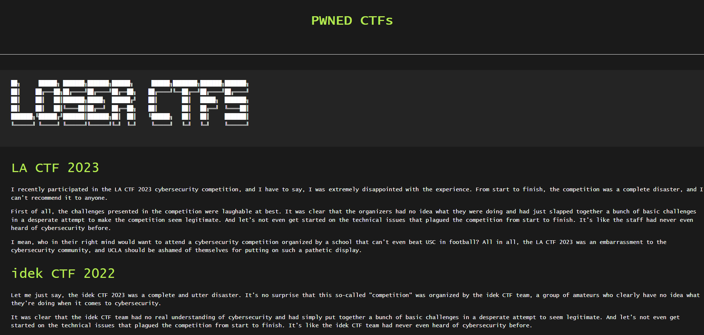

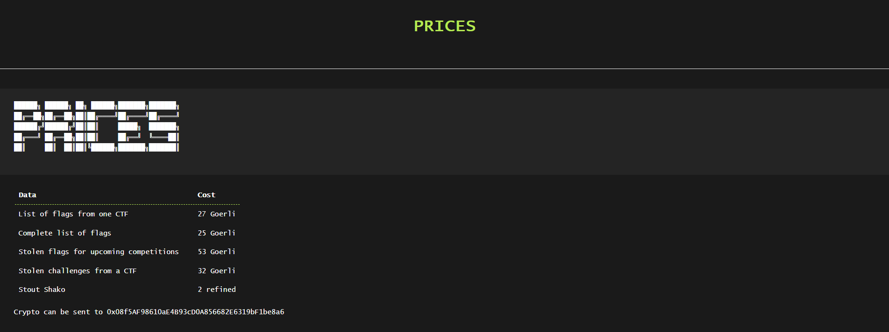

We've also got a footer with various social medias (which are all unsurprisingly rickrolls):

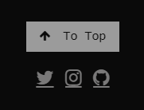

However, on the `/ctfs.html` page, upon further inspection of the source code we find a secret page, `/data.html`, linked under the Instagram icon:

```html title="ctfs.html" caption="Secret Page" showLineNumbers
      <footer class="w3-center w3-black w3-padding-64 w3-opacity w3-hover-opacity-off">
         <button onclick="topFunction()" class="w3-button w3-light-grey" title="Go to top"><i class="fa fa-arrow-up w3-margin-right w3-light-grey"></i>To Top</button>
         <div class="w3-xlarge w3-section">
            <!-- small logo with redirecting link -->
            <a href="https://youtu.be/dQw4w9WgXcQ" <i class="fa fa-twitter w3-hover-opacity"></a>
            <a href="data.html" <i class="fa fa-instagram w3-hover-opacity"></a>
            <a href="https://youtu.be/dQw4w9WgXcQ" <i class="fa fa-github w3-hover-opacity"></a>
         </div>
         <!-- page link -->
         </p>
      </footer>
```

Accessing the secret page reveals a secret download link:

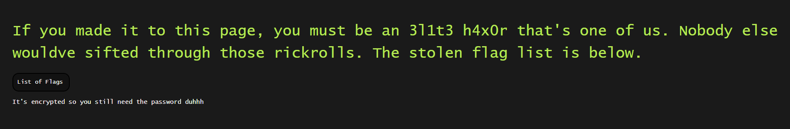

Downloading the file, we find a `flaglist.xlsx`, a Microsoft Excel document. There is an issue, however — the spreadsheet is completely encrypted via password protection, and we cannot import it to Google Sheets:

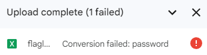

Let's see what we can do about this. Inspecting the source code of `/data.html`, we actually find that the file is being sourced from a GitHub account, `fl4gpwners`:

```html title="data.html" caption="Secret Page" showLineNumbers
      <h1 class="left topp">If you made it to this page, you must be an 3l1t3 h4x0r that's one of us. Nobody else wouldve sifted through those rickrolls. The stolen flag list is below. </h1>
      <a href="https://raw.githubusercontent.com/fl4gpwners/flaglist/main/flaglist.xlsx" class="button leftmar ">List of Flags</a>
      <p>      
      It's encrypted so you still need the password duhhh
      </p>
```

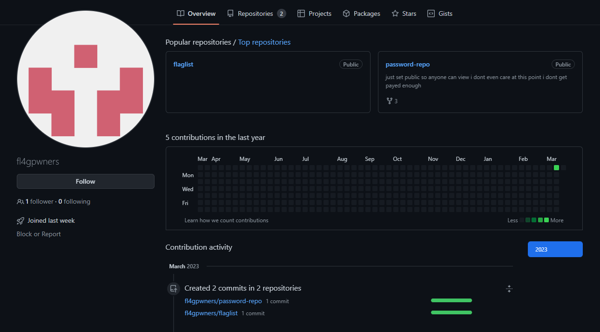

There happens to be an extraordinarily convenient `password-repo` repository on this GitHub account, which reveals a `passwords_stub.lst` file:

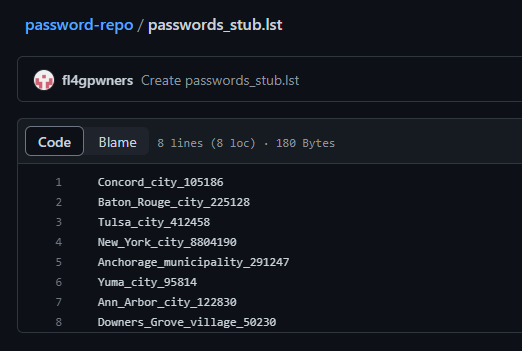

Unfortunately, none of the passwords in this list were accepted by the spreadsheet. However, it reveals extraordinarily useful information: the password list is a stub (as hinted by part of the filename), and the real password of the spreadsheet was likely part of the original document.

Let's further analyze the passwords which were given to us. We have the name of a U.S. city/town, followed by a number of some kind. Googling the city followed by the number reveals that the number is actually the population of the city which proceeds it; this means that `Concord_city` has a population of `105186`, `Baton_Rouge_city` has a population of `225128`, etc. We can use this information to our advantage to reassemble the password list, assuming it is every U.S. city/town followed by its population.

Upon further research, the population of the city was discovered to be sourced from the U.S. 2020 Census. [Census.gov](https://www.census.gov/data/tables/time-series/demo/popest/2020s-total-cities-and-towns.html), their official website, has various datasets of "Annual Estimates of the Resident Population for Incorporated Places of 50,000 or More." Importing the data into Google Sheets, we can see that this was the exact dataset which was used to generate the stub:

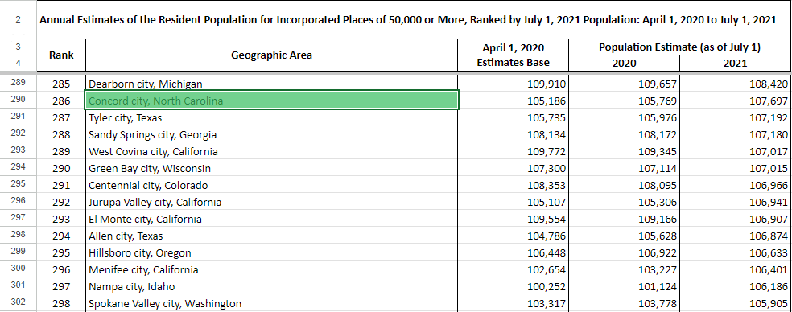

<Callout
 
>
  *Note**: See how the term “city”, “munincipality”, and “village” were lowercase in `password_stub.lst`? This is because the census uses these terms to categorize urban areas in the United States, and are not actually part of the area’s name. That is also why there are some entries which have two “cities” in their name (e.g. `Oklahoma City city`), as city is both part of the official city name and categorization.
</Callout>

Let's create a wordlist from this data. Although we can export it as a `.csv` and run a Python script to filter out the passwords, we can simply create a spreadsheet formula on another column to create the wordlist:

```py caption="Spreadsheet Formula"
=SUBSTITUTE(SUBSTITUTE(LEFT(B5,FIND(",",B5)-1)," ","_"),",","")&"_"&SUBSTITUTE(C5,",","")
```

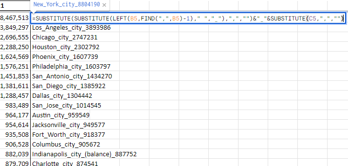

We can now copy the column into a text file, `wordlist.txt`, and use it to crack the spreadsheet. We'll be utilizing the `john` tool to achieve this.

Firstly, we need the hash of the spreadsheet. We can use the [`office2john.py`](https://github.com/openwall/john/blob/bleeding-jumbo/run/office2john.py) tool to extract the proper hash:

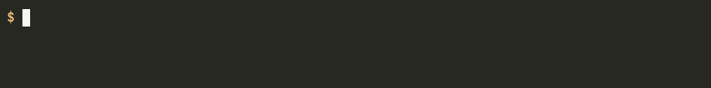

After we pipe it into a file, `hash.txt`, we can now finally run `john`:

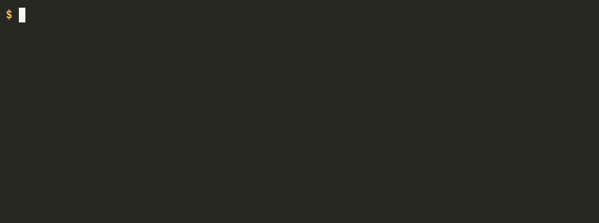

<Callout>
  For some reason, `john` when installed with `apt-get` doesn't have Office support (at least for me). Make sure that you are compiling from source if you want to use this tool (or just use `hashcat`)!
</Callout>

The password is `Great_Falls_city_60506`, which we can now use to open the spreadsheet:

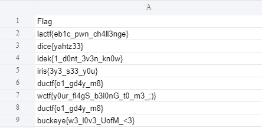

The flag is `wctf{y0ur_fl4gS_b3l0nG_t0_m3_;)}`.