import Challenge from '@/components/mdx/Challenge.astro'
import Callout from '@/components/mdx/Callout.astro'

<div class="invisible h-0! [&+*]:mt-0 [&+*_*]:mt-0">
## WannaFlag V: The Mastermind
</div>

<Challenge
  title="WannaFlag V: The Mastermind"
  authors={["dree"]}
  category="OSINT"
  points={500}
  solvers={[
    {
      name: 'Battlemonger',
      href: 'https://github.com/Battlemonger',
      avatar: 'https://github.com/Battlemonger.png',
    },
    {
      name: 'enscribe',
      href: 'https://github.com/jktrn',
      avatar: 'https://github.com/jktrn.png',
    },
    {
      name: 'sahuang',
      href: 'https://github.com/sahuang',
      avatar: 'https://github.com/sahuang.png',
    },
    {
      name: 'Violin',
    },
  ]}
  solves={6}
  flag="wctf{y0u_c4n_r0ck3tjUmp_bUt_y0u_c4nt_h1d3}"
>
  Alright, I don't know about you but I'm kinda sick of this WannaFlag group. I say we take them down once and for all. Maybe there's a way to figure out who is behind the whole operation...  
  Consider all possible leads and clues so far. This challenge may be the most complex so far.  
  No games or programs need to be downloaded, or users messaged.
</Challenge>

This challenge remained unsolved for a long while until the first hint was released:

> Perhaps we can find the Mastermind's email...

This immediately gave us a starting path to work with. We can find the email address of the user from the commit history of `fl4gpwners`; I found it from the [patch](https://github.com/fl4gpwners/flaglist/commit/9c689f4c2e0582d20577a951bf72ae243d65146a.patch) of the commit which uploaded `flaglist.xlsx` to the `flaglist` repository:

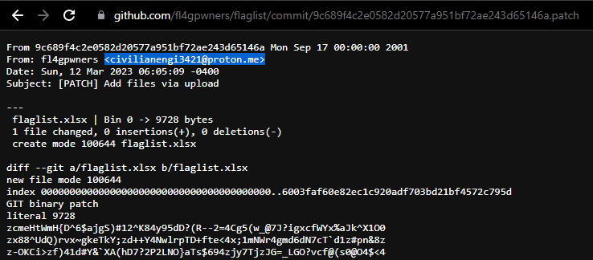

We've found a `civilianengi3421@proton.me` — from here, although various email OSINT strategies yielded no results (e.g. [Epieos](https://epieos.com/)), a simple keyword search on Google resulted in a [GameBanana](https://gamebanana.com/members/2530374) profile:

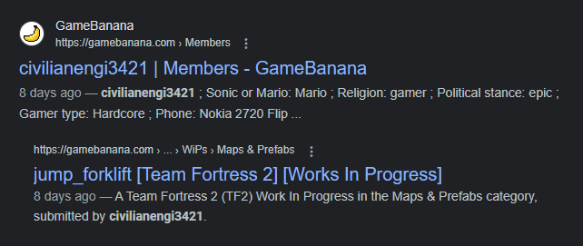

### The TF2 Connection

Let's take a look at this user. They currently have one submission, a map titled [`jump_forklift`](https://gamebanana.com/wips/74502) for the game [Team Fortress 2](https://www.teamfortress.com/):

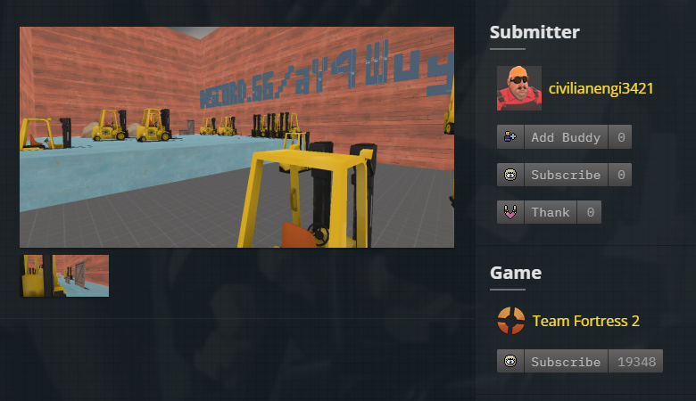

Check out that screenshot: it has a snippet of a Discord link, `discord.gg/aY4Wuy...`. It seems cut off, however, so we'll have to try and recover the rest of the invite.

Although we actually attempted to brute force the invite code (simply a two-character combination of `A-Z, a-z, 0-9`), we ended up completely IP rate-limited by Discord. So, like any logical person would do, I tried to open the map in the game itself.

To download maps into TF2, you need to subscribe to its respective workshop on Steam. Although GameBanana never explicitly provided the Steam account for this user (or so I believe), their Steam account conveniently had the same as their GameBanana, `civilianengi3421`:

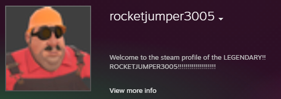

Here is the [workshop](https://steamcommunity.com/sharedfiles/filedetails/?id=2945817953) item associated with `jump_forklift`:

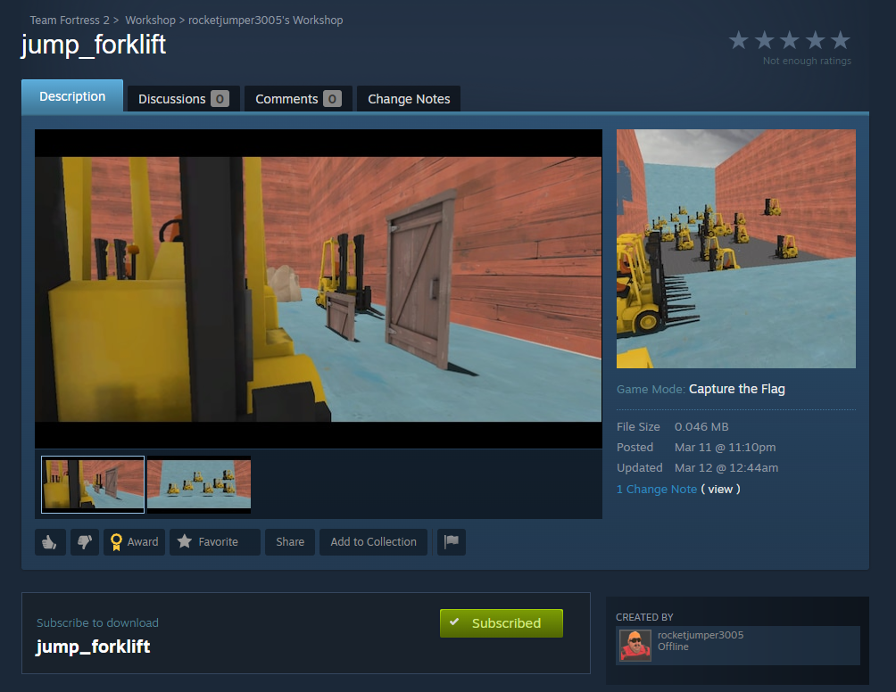

After subscribing to the item, I booted up TF2 for the first time in a couple of years to check out what was going on.

<Callout>
  **Note**: The challenge explicitly states that you **do not** need to download any games or programs. I just simply took the easy route and did so, anyways!
</Callout>

We can navigate to the "Create Server" menu and select the map at the bottom:

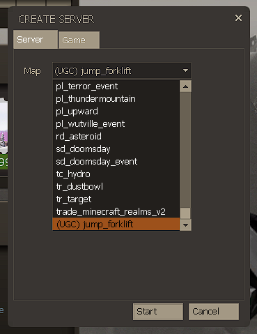

I entered the map and lo and behold, the Discord invite was fully visible:


Let's join the server... or not, I guess:

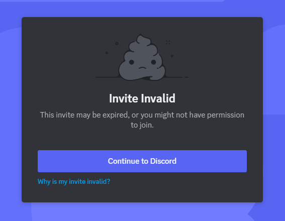

Although this hiccup had my team scratching their heads for a while, we eventually stumbled upon a discrepancy in the invite link presented in the screenshot and the one in the map — the screenshot's initial characters are `aY4Wuy...`, while the map has `aYWuyn...`. Let's try adding the missing character `4` to the invite link:

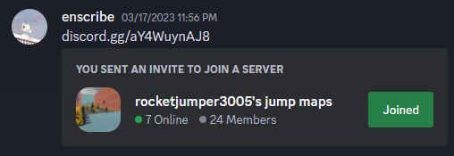

### The Discord Server

We've successfully gained access to the server! Let's take a look around:

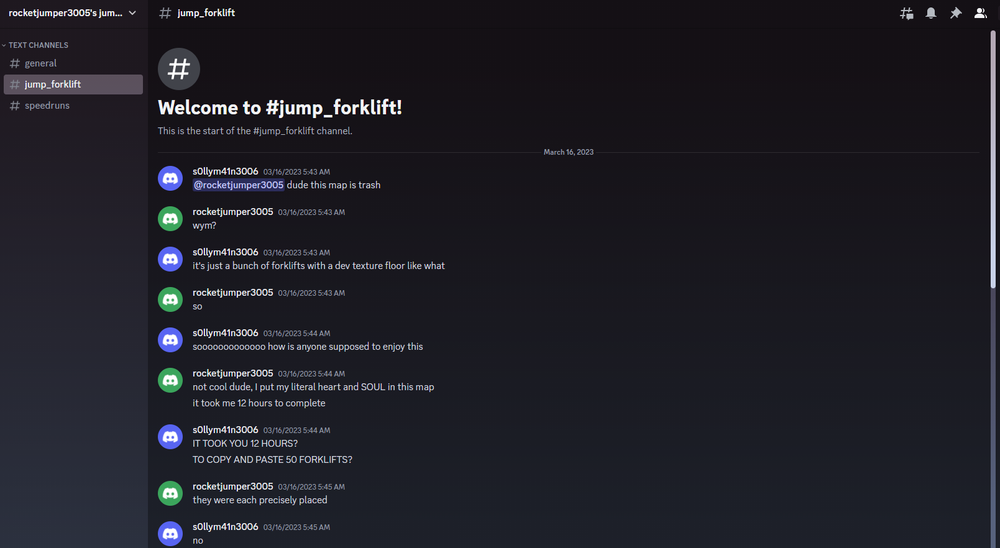

Although there's nothing of relevance in any of the channels, we see that the server has two individuals who have interacted with each other: `rocketjumper3005` and `s0llym41n3006`, who had left the server earlier. Let's run a Sherlock search on these two users and see what we can find:

```ansi
$ python3 sherlock.py rocketjumper3005
[*] Checking username rocketjumper3005 on:

[+] Coil: https://coil.com/u/rocketjumper3005

[*] Search completed with 1 results
```

```ansi
$ python3 sherlock.py s0llym41n3006
[*] Checking username s0llym41n3006 on:

[+] Coil: https://coil.com/u/s0llym41n3006
[+] Pastebin: https://pastebin.com/u/s0llym41n3006

[*] Search completed with 2 results
```

Coil was a false-positive, but that Pastebin account for the second user was a hit. Visiting their account reveals an interesting [paste](https://pastebin.com/GYJvaUNe):

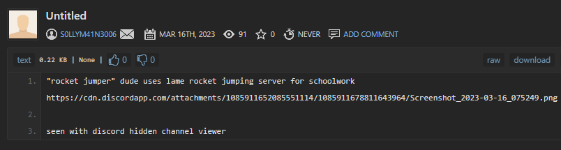

The paste reveals that the `rocketjumper3005` user had been keeping their schoolwork in the Discord server, and it had been visible using BetterDiscord's [ShowHiddenChannels](https://github.com/JustOptimize/return-ShowHiddenChannels) plugin. The following image was attached:

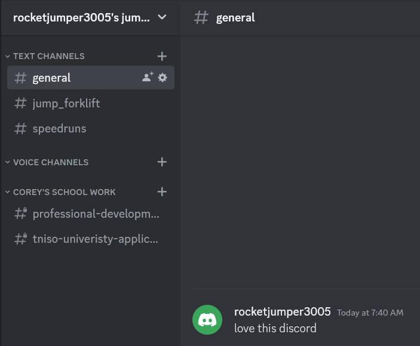

We're given a couple hints to pick at: `rocketjumper3005`'s real name is Corey, and he had been working on his application to "TNISO University." Let's run a Google search for "corey tniso university" on DuckDuckGo:

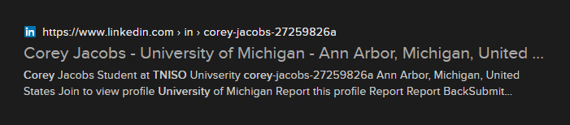

We've got him! This "Corey Jacobs" actually has a [LinkedIn](https://www.linkedin.com/in/corey-jacobs-27259826a/) profile:

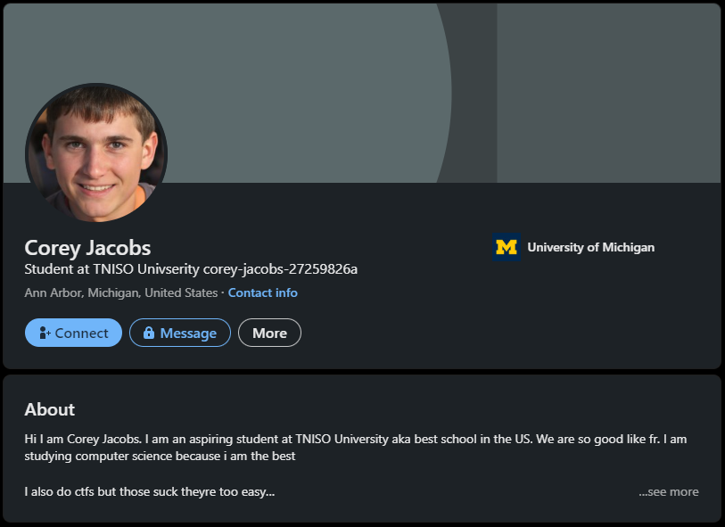

Expanding the "About" section reveals... some interesting text:

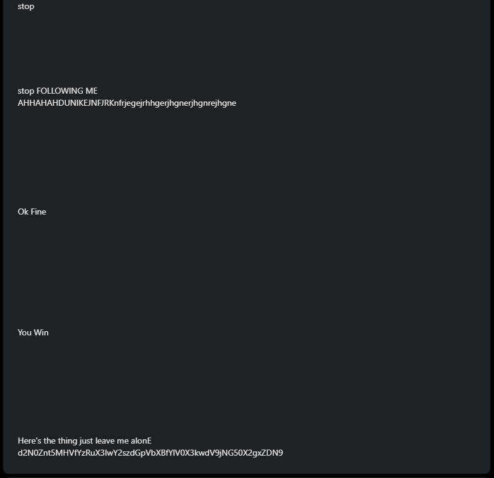

A [base64 decode](https://www.base64decode.org/) reveals our final flag: `wctf{y0u_c4n_r0ck3tjUmp_bUt_y0u_c4nt_h1d3}`.

---

## Afterword

This was an extraordinarily well-designed challenge. A lot of OSINT nowadays isn't creative at all, and doesn't employ any sort of "out-of-the-box" thinking. The WannaFlag series, however, was my breath of fresh air — it brought in some really wacky and unique stuff, like the TF2 map/Steam (the Excel password cracking bit was more forensics, but that's just part of the nature of OSINT in general). I hope to see more of these types of challenges in the future. Here is a compiled list of tools that I used throughout the challenge — I hope you find them useful:

-   [Google Lens](https://lens.google/)
-   [Goerli Testnet Explorer](https://goerli.etherscan.io/)
-   [Unddit](https://camas.unddit.com/)
-   [Sherlock.py](https://github.com/sherlock-project/sherlock)
-   [Epieos](https://epieos.com/)
-   [Wayback Machine](https://archive.org/)
